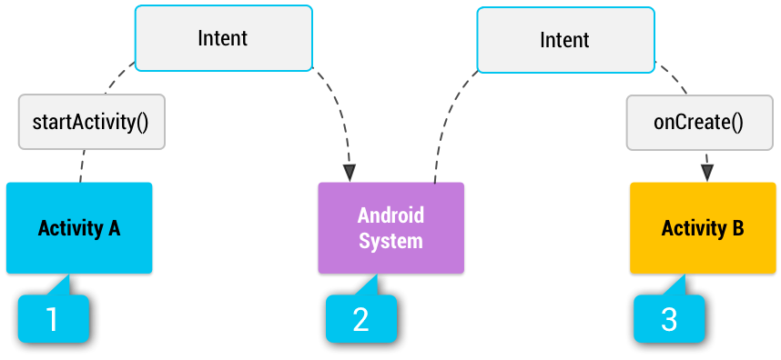

# Intent

## Intents and Intent Filters

* An `Intent` is a messaging object you can use to request an action from another **app component**. Although intents 
facilitate communication between components in several ways, there are three fundamental use cases:
  
  * **Starting an activity** 
    * An `Activity` represents a single screen in an app. You can start a new instance of an
    `Activity` by passing an `Intent` to `startActivity()`. The `Intent` describes the activity to start and carries 
    any necessary data.
    * If you want to receive a result from the activity when it finishes, call `startActivityForResult()`. Your 
    activity receives the result as a separate `Intent` object in your activity's `onActivityResult()` callback. 

  * **Starting a service**
    * A `Service` is a component that performs operations in the background without a user interface.
    * With Android 5.0 (API level 21) and later, you can start a service with `JobScheduler`.
    * For versions earlier than Android 5.0 (API level 21), you can start a service by using methods of the `Service` 
    class. You can start a service to perform a one-time operation (such as downloading a file) by passing an `Intent` 
    to `startService()`. The `Intent` describes the service to start and carries any necessary data.
    * If the service is designed with a client-server interface, you can bind to the service from another component by 
    passing an `Intent` to `bindService()`. 

  * **Delivering a broadcast**
    * A broadcast is a message that any app can receive. The system delivers various broadcasts for system events, such 
    as when the system boots up or the device starts charging. You can deliver a broadcast to other apps by passing an 
    `Intent` to `sendBroadcast()` or `sendOrderedBroadcast()`.

### Intent types

* There are two types of intents:
  * **Explicit intents** specify which application will satisfy the intent, by supplying either the target app's 
  package name or a fully-qualified component class name. You'll typically use an explicit intent to start a component 
  in your own app, because you know the class name of the activity or service you want to start. For example, you might 
  start a new activity within your app in response to a user action, or start a service to download a file in the 
  background.
  * **Implicit intents** do not name a specific component, but instead declare a general action to perform, which 
  allows a component from another app to handle it. For example, if you want to show the user a location on a map, you 
  can use an implicit intent to request that another capable app show a specified location on a map.

* Figure 1 shows how an intent is used when starting an activity. When the `Intent` object names a specific activity 
component explicitly, the system immediately starts that component.


> **Figure 1.** How an implicit intent is delivered through the system to start another activity: [1] Activity A 
> creates an `Intent` with an action description and passes it to `startActivity()`. [2] The Android System searches 
> all apps for an intent filter that matches the intent. When a match is found, [3] the system starts the matching 
> activity (Activity B) by invoking its `onCreate()` method and passing it the `Intent`.

* When you use an implicit intent, the Android system finds the appropriate component to start by comparing the 
contents of the intent to the **intent filters** declared in the manifest file of other apps on the device. If the 
intent matches an intent filter, the system starts that component and delivers it the `Intent` object. If multiple 
intent filters are compatible, the system displays a dialog so the user can pick which app to use.

* An **intent filter** is an expression in an app's manifest file that specifies the type of intents that the component 
would like to receive. For instance, by declaring an intent filter for an activity, you make it possible for other apps 
to directly start your activity with a certain kind of intent. Likewise, if you do not declare any intent filters for 
an activity, then it can be started only with an explicit intent.

> **Caution**: To ensure that your app is secure, always use an explicit intent when starting a `Service` and do not 
> declare intent filters for your services. Using an implicit intent to start a service is a security hazard because 
> you can't be certain what service will respond to the intent, and the user can't see which service starts. Beginning 
> with Android 5.0 (API level 21), the system throws an exception if you call `bindService()` with an implicit intent.

### Building an intent

* An `Intent` object carries information that the Android system uses to determine which component to start (such as 
the exact component name or component category that should receive the intent), plus information that the recipient 
component uses in order to properly perform the action (such as the action to take and the data to act upon).

* The primary information contained in an `Intent` is the following:

  * **Component name**
    * The name of the component to start. This is optional, but it's the critical piece of information that makes an 
    intent **explicit**, meaning that the intent should be delivered only to the app component defined by the component 
    name. Without a component name, the intent is **implicit** and the system decides which component should receive the 
    intent based on the other intent information (such as the action, data, and category—described below). If you need 
    to start a specific component in your app, you should specify the component name.
    > **Note**: When starting a `Service`, always specify the component name. Otherwise, you cannot be certain what 
    service will respond to the intent, and the user cannot see which service starts.
    * This field of the `Intent` is a `ComponentName` object, which you can specify using a fully qualified class name 
    of the target component, including the package name of the app, for example, `com.example.ExampleActivity`. You can 
    set the component name with `setComponent()`, `setClass()`, `setClassName()`, or with the `Intent` constructor.
  
  * **Action**
    * A string that specifies the generic action to perform (such as view or pick).
    * In the case of a broadcast intent, this is the action that took place and is being reported. The action largely 
    determines how the rest of the intent is structured—particularly the information that is contained in the data and 
    extras.
    * You can specify your own actions for use by intents within your app (or for use by other apps to invoke 
    components in your app), but you usually specify action constants defined by the `Intent` class or other framework 
    classes. Here are some common actions for starting an activity:
      * `ACTION_VIEW`
        * Use this action in an intent with `startActivity()` when you have some information that an activity can show 
        to the user, such as a photo to view in a gallery app, or an address to view in a map app.
      * `ACTION_SEND`
        * Also known as the share intent, you should use this in an intent with `startActivity()` when you have some 
        data that the user can share through another app, such as an email app or social sharing app.

    * You can specify the action for an intent with `setAction()` or with an `Intent` constructor.

    * If you define your own actions, be sure to include your app's package name as a prefix, as shown in the 
    following example:

    ```kotlin
    const val ACTION_TIMETRAVEL = "com.example.action.TIMETRAVEL"
    ```
  * **Data**
    * The URI (a `Uri` object) that references the data to be acted on and/or the MIME type of that data. The type of 
    data supplied is generally dictated by the intent's action. For example, if the action is `ACTION_EDIT`, the data 
    should contain the URI of the document to edit.
    * When creating an intent, it's often important to specify the type of data (its MIME type) in addition to its URI. 
    For example, an activity that's able to display images probably won't be able to play an audio file, even though 
    the URI formats could be similar. Specifying the MIME type of your data helps the Android system find the best 
    component to receive your intent. However, the MIME type can sometimes be inferred from the URI — particularly when 
    the data is a `content:` URI. A `content:` URI indicates the data is located on the device and controlled by a 
    `ContentProvider`, which makes the data MIME type visible to the system.
    * To set only the data URI, call `setData()`. To set only the MIME type, call `setType()`. If necessary, you can 
    set both explicitly with `setDataAndType()`.
    > **Caution**: If you want to set both the URI and MIME type, don't call `setData()` and `setType()` because they 
    > each nullify the value of the other. Always use `setDataAndType()` to set both URI and MIME type.
  
  * **Category**
    * A string containing additional information about the kind of component that should handle the intent. Any number 
    of category descriptions can be placed in an intent, but most intents do not require a category. Here are some 
    common categories:
      * `CATEGORY_BROWSABLE`
        * The target activity allows itself to be started by a web browser to display data referenced by a link, such 
        as an image or an e-mail message.
      * `CATEGORY_LAUNCHER`
        * The activity is the initial activity of a task and is listed in the system's application launcher.
    * You can specify a category with `addCategory()`.

* These properties listed above (component name, action, data, and category) represent the defining characteristics of 
an intent. By reading these properties, the Android system is able to resolve which app component it should start. 
However, an intent can carry additional information that does not affect how it is resolved to an app component. An 
intent can also supply the following information:
  * **Extras**
    * Key-value pairs that carry additional information required to accomplish the requested action. Just as some 
    actions use particular kinds of data URIs, some actions also use particular extras. You can add extra data with 
    various `putExtra()` methods, each accepting two parameters: the key name and the value. You can also create a 
    `Bundle` object with all the extra data, then insert the `Bundle` in the `Intent` with `putExtras()`. 
    * For example, when creating an intent to send an email with `ACTION_SEND`, you can specify the to recipient with 
    the `EXTRA_EMAIL` key, and specify the subject with the `EXTRA_SUBJECT` key.
    * The `Intent` class specifies many `EXTRA_*` constants for standardized data types. If you need to declare your 
    own extra keys (for intents that your app receives), be sure to include your app's package name as a prefix, as 
    shown in the following example:
    ```kotlin
    const val EXTRA_GIGAWATTS = "com.example.EXTRA_GIGAWATTS"
    ```
    > **Caution**: Do not use `Parcelable` or `Serializable` data when sending an intent that you expect another app to 
    > receive. If an app attempts to access data in a `Bundle` object but does not have access to the parceled or 
    > serialized class, the system raises a `RuntimeException`.
  
  * **Flags**
    * Flags are defined in the `Intent` class that function as metadata for the intent. The flags may instruct the 
    Android system how to launch an activity (for example, which task the activity should belong to) and how to treat 
    it after it's launched (for example, whether it belongs in the list of recent activities).

### Example explicit intent

* An explicit intent is one that you use to launch a specific app component, such as a particular activity or service 
in your app. To create an explicit intent, define the component name for the `Intent` object — all other intent 
properties are optional.

* For example, if you built a service in your app, named `DownloadService`, designed to download a file from the web, 
you can start it with the following code:

```kotlin
// Executed in an Activity, so 'this' is the Context
// The fileUrl is a string URL, such as "http://www.example.com/image.png"
val downloadIntent = Intent(this, DownloadService::class.java).apply {
    data = Uri.parse(fileUrl)
}
startService(downloadIntent)
```

* The `Intent(Context, Class)` constructor supplies the app `Context` and the component a `Class` object. As such, this 
intent explicitly starts the `DownloadService` class in the app.

### Example implicit intent

* An implicit intent specifies an action that can invoke any app on the device able to perform the action. Using an 
implicit intent is useful when your app cannot perform the action, but other apps probably can and you'd like the user 
to pick which app to use.

* For example, if you have content that you want the user to share with other people, create an intent with the 
`ACTION_SEND` action and add extras that specify the content to share. When you call `startActivity()` with that intent, 
the user can pick an app through which to share the content.

```kotlin
// Create the text message with a string.
val sendIntent = Intent().apply {
    action = Intent.ACTION_SEND
    putExtra(Intent.EXTRA_TEXT, textMessage)
    type = "text/plain"
}

// Try to invoke the intent.
try {
    startActivity(sendIntent)
} catch (e: ActivityNotFoundException) {
    // Define what your app should do if no activity can handle the intent.
}
```

* When `startActivity()` is called, the system examines all of the installed apps to determine which ones can handle 
this kind of intent (an intent with the `ACTION_SEND` action and that carries "text/plain" data). If there's only one 
app that can handle it, that app opens immediately and is given the intent. If no other apps can handle it, your app 
can catch the `ActivityNotFoundException` that occurs. If multiple activities accept the intent, the system displays a 
dialog, so the user can pick which app to use.

### Forcing an app chooser

* To show the chooser, create an `Intent` using `createChooser()` and pass it to `startActivity()`, as shown in the 
following example. This example displays a dialog with a list of apps that respond to the intent passed to the 
`createChooser()` method and uses the supplied text as the dialog title.

```kotlin
val sendIntent = Intent(Intent.ACTION_SEND)
// ...

// Always use string resources for UI text.
// This says something like "Share this photo with"
val title: String = resources.getString(R.string.chooser_title)
// Create intent to show the chooser dialog
val chooser: Intent = Intent.createChooser(sendIntent, title)

// Verify the original intent will resolve to at least one activity
if (sendIntent.resolveActivity(packageManager) != null) {
    startActivity(chooser)
}
```

### Detect unsafe intent launches

* Your app might launch intents to navigate between components inside of your app, or to perform an action on behalf of 
another app. To improve platform security, Android 12 (API level 31) and higher provide a debugging feature that warns 
you if your app performs an unsafe launch of an intent. For example, your app might perform an unsafe launch of a 
nested intent, which is an intent that is passed as an extra in another intent.

* If your app performs both of the following actions, the system detects an unsafe intent launch, and a `StrictMode` 
violation occurs:
  * Your app unparcels a nested intent from the extras of a delivered intent. 
  * Your app immediately starts an **app component** using that nested intent, such as passing the intent into 
  `startActivity()`, `startService()`, or `bindService()`.

* To check for unsafe intent launches in your app, call `detectUnsafeIntentLaunch()` when you configure your `VmPolicy`.

### Use intents more responsibly

* To minimize the chance of an unsafe intent launch, and a StrictMode violation, follow these best practices.
  * **Copy only the essential extras within intents, and perform any necessary sanitation and validation**. Your app 
  might copy the extras from one intent to another intent that is used to launch a new component. This occurs when your 
  app calls `putExtras(Intent)` or `putExtras(Bundle)`. If your app performs one of these operations, copy only the 
  extras that the receiving component expects. If the other intent (that receives the copy) launches a component that 
  isn't `exported`, sanitize and validate the extras before copying them to the intent that launches the component.
  * **Don't export your app's components unnecessarily**. For example, if you intend to launch an app component using 
  an internal nested intent, set that component's `android:exported` attribute to `false`.
  * **Use a `PendingIntent` instead of a nested intent**. That way, when another app unparcels the `PendingIntent` of 
  its containing `Intent`, the other app can launch the `PendingIntent` using the identity of your app. This 
  configuration allows the other app to safely launch any component, including a non-exported component, in your app.
  
* The diagram shows how the system passes control from your (client) app to another (service) app, and back to your app:

### Receiving an implicit intent

* To advertise which implicit intents your app can receive, declare one or more intent filters for each of your app 
components with an `<intent-filter>` element in your manifest file. Each intent filter specifies the type of intents it 
accepts based on the intent's action, data, and category. The system delivers an implicit intent to your app component 
only if the intent can pass through one of your intent filters.

> **Note**: An explicit intent is always delivered to its target, regardless of any intent filters the component 
> declares.

* An app component should declare separate filters for each unique job it can do. For example, one activity in an image 
gallery app may have two filters: one filter to view an image, and another filter to edit an image. When the activity 
starts, it inspects the `Intent` and decides how to behave based on the information in the `Intent` (such as to show 
the editor controls or not).

* Each intent filter is defined by an `<intent-filter>` element in the app's manifest file, nested in the corresponding 
app component (such as an `<activity>` element).

* In each app component that includes an `<intent-filter>` element, explicitly set a value for `android:exported`. This 
attribute indicates whether the app component is accessible to other apps. In some situations, such as activities whose 
intent filters include the `LAUNCHER` category, it's useful to set this attribute to `true`. Otherwise, it's safer to 
set this attribute to `false`.

> **Warning**: If an activity, service, or broadcast receiver in your app uses intent filters and doesn't explicitly 
>set the value for `android:exported`, your app can't be installed on a device that runs Android 12 or higher.

* Inside the `<intent-filter>`, you can specify the type of intents to accept using one or more of these three elements:
  * `<action>`
    * Declares the intent action accepted, in the `name` attribute. The value must be the literal string value of an 
    action, not the class constant.
  * `<data>`
    * Declares the type of data accepted, using one or more attributes that specify various aspects of the data URI 
    (`scheme`, `host`, `port`, `path`) and MIME type.
  * `<category>`
    * Declares the intent category accepted, in the name attribute. The value must be the literal string value of an 
    action, not the class constant.
    > **Note**: To receive implicit intents, you must include the `CATEGORY_DEFAULT` category in the intent filter. The 
    > methods `startActivity()` and `startActivityForResult()` treat all intents as if they declared the 
    > `CATEGORY_DEFAULT` category. If you do not declare this category in your intent filter, no implicit intents will 
    > resolve to your activity.

* Here's an activity declaration with an intent filter to receive an `ACTION_SEND` intent when the data type is text:

```xml
<activity android:name="ShareActivity" android:exported="false">
    <intent-filter>
        <action android:name="android.intent.action.SEND"/>
        <category android:name="android.intent.category.DEFAULT"/>
        <data android:mimeType="text/plain"/>
    </intent-filter>
</activity>
```

* You can create a filter that includes more than one instance of `<action>`, `<data>`, or `<category>`. If you do, you 
need to be certain that the component can handle any and all combinations of those filter elements.

* When you want to handle multiple kinds of intents, but only in specific combinations of action, data, and category 
type, then you need to create multiple intent filters.

* An implicit intent is tested against a filter by comparing the intent to each of the three elements. To be delivered 
to the component, the intent must pass all three tests. If it fails to match even one of them, the Android system won't 
deliver the intent to the component. However, because a component may have multiple intent filters, an intent that does 
not pass through one of a component's filters might make it through on another filter.

> **Caution**: Using an intent filter isn't a secure way to prevent other apps from starting your components. Although 
> intent filters restrict a component to respond to only certain kinds of implicit intents, another app can potentially 
> start your app component by using an explicit intent if the developer determines your component names. If it's 
> important that only your own app is able to start one of your components, do not declare intent filters in your 
> manifest. Instead, set the `exported` attribute to "`false`" for that component.

> `Note`: For all activities, you must declare your intent filters in the manifest file. However, filters for broadcast 
> receivers can be registered dynamically by calling `registerReceiver()`. You can then unregister the receiver with 
> `unregisterReceiver()`. Doing so allows your app to listen for specific broadcasts during only a specified period of 
> time while your app is running.

#### Example filters

```xml
<activity android:name="MainActivity" android:exported="true">
    <!-- This activity is the main entry, should appear in app launcher -->
    <intent-filter>
        <action android:name="android.intent.action.MAIN" />
        <category android:name="android.intent.category.LAUNCHER" />
    </intent-filter>
</activity>

<activity android:name="ShareActivity" android:exported="false">
    <!-- This activity handles "SEND" actions with text data -->
    <intent-filter>
        <action android:name="android.intent.action.SEND"/>
        <category android:name="android.intent.category.DEFAULT"/>
        <data android:mimeType="text/plain"/>
    </intent-filter>
    <!-- This activity also handles "SEND" and "SEND_MULTIPLE" with media data -->
    <intent-filter>
        <action android:name="android.intent.action.SEND"/>
        <action android:name="android.intent.action.SEND_MULTIPLE"/>
        <category android:name="android.intent.category.DEFAULT"/>
        <data android:mimeType="application/vnd.google.panorama360+jpg"/>
        <data android:mimeType="image/*"/>
        <data android:mimeType="video/*"/>
    </intent-filter>
</activity>
```

* The first activity, `MainActivity`, is the app's main entry point—the activity that opens when the user initially 
launches the app with the launcher icon:
  * The `ACTION_MAIN` action indicates this is the main entry point and does not expect any intent data.
  * The `CATEGORY_LAUNCHER` category indicates that this activity's icon should be placed in the system's app launcher. 
  If the `<activity>` element does not specify an icon with `icon`, then the system uses the icon from the 
  `<application>` element.
  
* These two must be paired together in order for the activity to appear in the app launcher.

* The second activity, `ShareActivity`, is intended to facilitate sharing text and media content. Although users might 
enter this activity by navigating to it from `MainActivity`, they can also enter `ShareActivity` directly from another 
app that issues an implicit intent matching one of the two intent filters.

### Match intents to other apps' intent filters

* If another app targets Android 13 (API level 33) or higher, it can handle your app's intent only if your intent 
matches the actions and categories of an `<intent-filter>` element in that other app.

* Similarly, if you update your app so that it targets Android 13 or higher, all intents originating from external apps 
are delivered to an exported component of your app only if that intent matches the actions and categories of an 
`<intent-filter>` element that your app declares. This behavior occurs regardless of the sending app's target SDK 
version.

### Using a pending intent

* A `PendingIntent` object is a wrapper around an `Intent` object. The primary purpose of a `PendingIntent` is to grant 
permission to a foreign application to use the contained `Intent` as if it were executed from your app's own process.

* Major use cases for a pending intent include the following:
  * Declaring an intent to be executed when the user performs an action with your **Notification** (the Android 
  system's `NotificationManager` executes the `Intent`). 
  * Declaring an intent to be executed when the user performs an action with your **App Widget** (the Home screen app 
  executes the `Intent`).
  * Declaring an intent to be executed at a specified future time (the Android system's `AlarmManager` executes the 
  `Intent`).

* Just as each `Intent` object is designed to be handled by a specific type of app component (either an `Activity`, a 
`Service`, or a `BroadcastReceiver`), so too must a `PendingIntent` be created with the same consideration. When using 
a pending intent, your app doesn't execute the intent with a call such as `startActivity()`. Instead, you must declare 
the intended component type when you create the `PendingIntent` by calling the respective creator method:
  * `PendingIntent.getActivity()` for an `Intent` that starts an `Activity`. 
  * `PendingIntent.getService()` for an `Intent` that starts a `Service`. 
  * `PendingIntent.getBroadcast()` for an `Intent` that starts a `BroadcastReceiver`.

#### Specify mutability

* If your app targets Android 12 or higher, you must specify the mutability of each `PendingIntent` object that your 
app creates. To declare that a given `PendingIntent` object is mutable or immutable, use the 
`PendingIntent.FLAG_MUTABLE` or `PendingIntent.FLAG_IMMUTABLE` flag, respectively.

* If your app attempts to create a `PendingIntent` object without setting either mutability flag, the system throws 
an `IllegalArgumentException`.

#### Create immutable pending intents whenever possible

* In most cases, your app should create immutable `PendingIntent` objects. If a `PendingIntent` object is immutable, 
then other apps cannot modify the intent to adjust the result of invoking the intent.

```kotlin
val pendingIntent = PendingIntent.getActivity(applicationContext,
        REQUEST_CODE, intent,
        /* flags */ PendingIntent.FLAG_IMMUTABLE)
```

* However, certain use cases require mutable `PendingIntent` objects instead:
  * Supporting direct reply actions in notifications. 
  * Associating notifications with the Android Auto framework, using instances of `CarAppExtender`.
  * Placing conversations in bubbles using instances of `PendingIntent`.
  * Requesting device location information by calling `requestLocationUpdates()` or similar APIs.
  * Scheduling alarms using `AlarmManager`. 

* If your app creates a mutable `PendingIntent` object, it's strongly recommended that you use an **explicit intent** 
and fill in the `ComponentName`. That way, whenever another app invokes the PendingIntent and passes control back to 
your app, the same component in your app always starts.

#### Use explicit intents within pending intents

* To better define how other apps can use your app's pending intents, always wrap a pending intent around an 
**explicit intent**. To help follow this best practice, do the following:
  * Check that the action, package, and component fields of the base intent are set. 
  * Use `FLAG_IMMUTABLE`, added in Android 6.0 (API level 23), to create pending intents. This flag prevents apps that 
  receive a `PendingIntent` from filling in unpopulated properties. If your app's `minSdkVersion` is `22` or lower, you 
  can provide safety and compatibility together using the following code:
  ```kotlin
  if (Build.VERSION.SDK_INT >= 23) {
  // Create a PendingIntent using FLAG_IMMUTABLE.
  } else {
  // Existing code that creates a PendingIntent.
  }
  ```

### Intent resolution

* When the system receives an implicit intent to start an activity, it searches for the best activity for the intent by 
comparing it to intent filters based on three aspects:
  * Action. 
  * Data (both URI and data type). 
  * Category.

#### Action test

* To specify accepted intent actions, an intent filter can declare zero or more `<action>` elements, as shown in the 
following example:

```xml
<intent-filter>
    <action android:name="android.intent.action.EDIT" />
    <action android:name="android.intent.action.VIEW" />
    ...
</intent-filter>
```

* To pass this filter, the action specified in the `Intent` must match one of the actions listed in the filter.

* If the filter does not list any actions, there is nothing for an intent to match, so all intents fail the test. 
However, if an `Intent` does not specify an action, it passes the test as long as the filter contains at least one 
action.

#### Category test

* To specify accepted intent categories, an intent filter can declare zero or more `<category>` elements.

```xml
<intent-filter>
    <category android:name="android.intent.category.DEFAULT" />
    <category android:name="android.intent.category.BROWSABLE" />
    ...
</intent-filter>
```

* For an intent to pass the category test, every category in the `Intent` must match a category in the filter. The 
reverse is not necessary—the intent filter may declare more categories than are specified in the `Intent` and the 
`Intent` still passes. Therefore, an intent with no categories always passes this test, regardless of what categories 
are declared in the filter.

#### Data test

* To specify accepted intent data, an intent filter can declare zero or more `<data>` elements.

```xml
<intent-filter>
    <data android:mimeType="video/mpeg" android:scheme="http" ... />
    <data android:mimeType="audio/mpeg" android:scheme="http" ... />
    ...
</intent-filter>
```

* Each `<data>` element can specify a URI structure and a data type (MIME media type). Each part of the URI is a 
separate attribute: `scheme`, `host`, `port`, and `path`:
  * `<scheme>://<host>:<port>/<path>`

* The following example shows possible values for these attributes:
  * `content://com.example.project:200/folder/subfolder/etc`

* In this URI, the scheme is `content`, the host is `com.example.project`, the port is `200`, and the path is 
`folder/subfolder/etc`.

* Each of these attributes is optional in a `<data>` element, but there are linear dependencies:
  * If a scheme is not specified, the host is ignored. 
  * If a host is not specified, the port is ignored. 
  * If both the scheme and host are not specified, the path is ignored.

* When the URI in an intent is compared to a URI specification in a filter, it's compared only to the parts of the URI 
included in the filter.

> **Note**: A path specification can contain a wildcard asterisk (*) to require only a partial match of the path name.

---

* Intents and Intent Filters: https://developer.android.com/guide/components/intents-filters