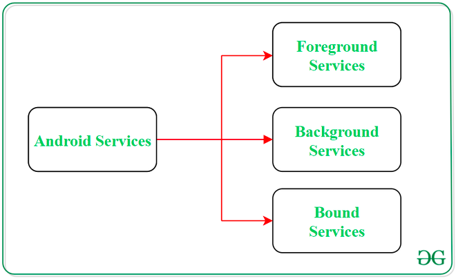
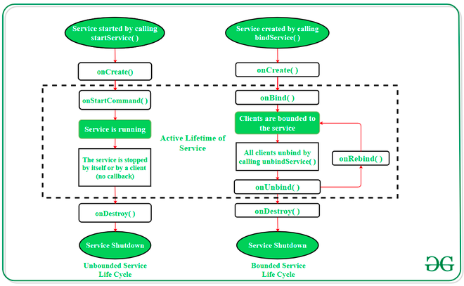

# Service

* **Services** in **Android** are a special component that facilitates an application to run in the background in order to perform long-running operation tasks. The prime aim of a service is to ensure that the application remains active in the background so that the user can operate multiple applications at the same time. A user-interface is not desirable for android services as it is designed to operate long-running processes without any user intervention. A service can run continuously in the background even if the application is closed or the user switches to another application. Further, application components can bind itself to service to carry out **inter-process communication(IPC)**. There is a major difference between android services and threads, one must not be confused between the two. Thread is a feature provided by the Operating system to allow the user to perform operations in the background. While service is an **android component** that performs a long-running operation about which the user might not be aware of as it does not have UI.

* Thus a Service itself is actually very simple, providing two main features:
  * A facility for the application to tell the system about something it wants to be doing in the background (even when the user is not directly interacting with the application). This corresponds to calls to `Context.startService()`, which ask the system to schedule work for the service, to be run until the service or someone else explicitly stop it. 
  * A facility for an application to expose some of its functionality to other applications. This corresponds to calls to `Context.bindService()`, which allows a long-standing connection to be made to the service in order to interact with it.

---

## Types of Android Services


> Figure 1. Types of Android Services.

### 1. Foreground Services:

* Services that notify the user about its ongoing operations are termed as Foreground Services. Users can interact with the service by the **notifications** provided about the ongoing task. The notification must have a priority of `PRIORITY_LOW` or higher and must be visible even when the user isn’t interacting with the app. Such as in downloading a file, the user can keep track of the progress in downloading and can also pause and resume the process.

* The user can’t dismiss the notification; it disappears when the service stops or leaves the foreground.

### 2. Background Services:

* Background services do not require any user intervention. These services do not notify the user about ongoing background tasks and users also cannot access them. The process like schedule syncing of data or storing of data fall under this service.

### 3. Bound Services:

* This type of android service allows the components of the application like activity to bound themselves with it. Bound services perform their task as long as any application component is bound to it. More than one component is allowed to bind themselves with a service at a time. In order to bind an application component with a service `bindService()` method is used. 

---

## The Life Cycle of Android Services

* There are two reasons that a service can be run by the system. If someone calls `Context.startService()` then the system will retrieve the service (creating it and calling its `onCreate()` method if needed) and then call its `onStartCommand(Intent, int, int)` method with the arguments supplied by the client. The service will at this point continue running until `Context.stopService()` or `stopSelf()` is called. Note that multiple calls to `Context.startService()` do not nest (though they do result in multiple corresponding calls to `onStartCommand()`), so no matter how many times it is started a service will be stopped once `Context.stopService()` or `stopSelf()` is called; however, services can use their `stopSelf(int)` method to ensure the service is not stopped until started intents have been processed.

* For started services, there are two additional major modes of operation they can decide to run in, depending on the value they return from onStartCommand(): `START_STICKY` is used for services that are explicitly started and stopped as needed, while `START_NOT_STICKY` or `START_REDELIVER_INTENT` are used for services that should only remain running while processing any commands sent to them.

* Clients can also use `Context.bindService()` to obtain a persistent connection to a service. This likewise creates the service if it is not already running (calling `onCreate()` while doing so), but does not call `onStartCommand()`. The client will receive the `IBinder` object that the service returns from its `onBind(Intent)` method, allowing the client to then make calls back to the service. The service will remain running as long as the connection is established (whether or not the client retains a reference on the service's `IBinder`).

* A service can be both started and have connections bound to it. In such a case, the system will keep the service running as long as either it is started or there are one or more connections to it with the `Context.BIND_AUTO_CREATE` flag. Once neither of these situations hold, the service's `onDestroy()` method is called and the service is effectively terminated. All cleanup (stopping threads, unregistering receivers) should be complete upon returning from `onDestroy()`.

* In android, services have 2 possible paths to complete its life cycle namely **Started** and **Bounded**.

### 1. Started Service (Unbounded Service):

* By following this path, a service will initiate when an application component calls the `startService()` method. Once initiated, the service can run continuously in the background even if the component is destroyed which was responsible for the start of the service. Two option are available to stop the execution of service:
  * By calling `stopService()` method, 
  * The service can stop itself by using `stopSelf()` method.

### 2. Bounded Service:

* It can be treated as a server in a client-server interface. By following this path, android application components can send requests to the service and can fetch results. A service is termed as bounded when an application component binds itself with a service by calling `bindService()` method. To stop the execution of this service, all the components must unbind themselves from the service by using `unbindService()` method.


> Figure 2. Active Lifetime of Service.

* To carry out a downloading task in the background, the `startService()` method will be called. Whereas to get information regarding the download progress and to pause or resume the process while the application is still in the background, **the service must be bounded with a component** which can perform these tasks.

---

## Fundamentals of Android Services

* A user-defined service can be created through a normal class which is extending the class `Service`. Further, to carry out the operations of service on applications, there are certain callback methods which are needed to be **overridden**. The following are some of the important methods of Android Services:


| Methods            | Description                                                                                                                                                                                                                                                                                                                                                                                                                                                                                                                                                                                                                                                                                                                                                                                                                                                                                                                                                                                                                                                |
|--------------------|------------------------------------------------------------------------------------------------------------------------------------------------------------------------------------------------------------------------------------------------------------------------------------------------------------------------------------------------------------------------------------------------------------------------------------------------------------------------------------------------------------------------------------------------------------------------------------------------------------------------------------------------------------------------------------------------------------------------------------------------------------------------------------------------------------------------------------------------------------------------------------------------------------------------------------------------------------------------------------------------------------------------------------------------------------|
| `onStartCommand()` | The Android service calls this method when a component(eg: activity) requests to start a service using `startService()`. Once the system calls `onStartCommand()`, the service can run in the background for as long as it takes to complete.  Once the service is started, it can be stopped explicitly using `stopService()` or `stopSelf()` methods. <br/> There are severals flags is set in `onStartCommand(Intent, int, int)`. If the system kills the service because the memory runs out, `START_NOT_STICKY` tells the system not to recreate the service with an undefined Intent. Alternative constants are `START_STICKY` and `START_REDELIVER_INTENT`. <br/> **Note** that the system calls this on your service's main thread. A service's main thread is the same thread where UI operations take place for Activities running in the same process. You should always avoid stalling the main thread's event loop. When doing long-running operations, network calls, or heavy disk I/O, you should kick off a new thread, or use AsyncTask. |
| `onBind()`         | This method is mandatory to implement in android service and is invoked whenever an application component calls the `bindService()` method in order to bind itself with a service. User-interface is also provided to communicate with the service effectively by returning an `IBinder` object. If the binding of service is not required then the method must return `null`. <br/> `IBinder` is a programming interface of **Binder** that clients use to interact with the service. Its methods allow you to send a call to an IBinder object and receive a call coming in to a Binder object. To learn more, [check out IBinder’s documentation](https://developer.android.com/reference/android/os/IBinder).                                                                                                                                                                                                                                                                                                                                          |
| `onUnbind()`       | The Android system invokes this method when all the clients get disconnected from a particular service interface.                                                                                                                                                                                                                                                                                                                                                                                                                                                                                                                                                                                                                                                                                                                                                                                                                                                                                                                                          |
| `onRebind()`       | Once all clients are disconnected from the particular interface of service and there is a need to connect the service with new clients, the system calls this method. <br/> This will only be called if the implementation of `onUnbind(Intent)` was overridden to return true.                                                                                                                                                                                                                                                                                                                                                                                                                                                                                                                                                                                                                                                                                                                                                                            |
| `onCreate()`       | Whenever a service is created either using `onStartCommand()` or `onBind()`, the android system calls this method. This method is necessary to perform a one-time-set-up.                                                                                                                                                                                                                                                                                                                                                                                                                                                                                                                                                                                                                                                                                                                                                                                                                                                                                  |
| `onDestroy()`      | When a service is no longer in use, the system invokes this method just before the service destroys as a final clean up call. Services must implement this method in order to clean up resources like registered listeners, threads, receivers, etc.                                                                                                                                                                                                                                                                                                                                                                                                                                                                                                                                                                                                                                                                                                                                                                                                       |

The following are some of the less important methods of Android Services:

| Methods                      | Description                                                                                                                                                                                                                                                                                                                                                                                                                                                                                                                                                                                                                                                                                                                                                                                                                                                                                                                                                                                                                                                                        |
|------------------------------|------------------------------------------------------------------------------------------------------------------------------------------------------------------------------------------------------------------------------------------------------------------------------------------------------------------------------------------------------------------------------------------------------------------------------------------------------------------------------------------------------------------------------------------------------------------------------------------------------------------------------------------------------------------------------------------------------------------------------------------------------------------------------------------------------------------------------------------------------------------------------------------------------------------------------------------------------------------------------------------------------------------------------------------------------------------------------------|
| `getApplication()`           | Return the application that owns this service.                                                                                                                                                                                                                                                                                                                                                                                                                                                                                                                                                                                                                                                                                                                                                                                                                                                                                                                                                                                                                                     |
| `getForegroundServiceType()` | If the service has become a foreground service by calling `startForeground(int, android.app.Notification)` or `startForeground(int, android.app.Notification, int)`, `getForegroundServiceType()` returns the current foreground service type. <br/> If there is no foregroundServiceType specified in manifest, `ServiceInfo#FOREGROUND_SERVICE_TYPE_NONE` is returned. <br/> If the service is not a foreground service, `ServiceInfo#FOREGROUND_SERVICE_TYPE_NONE` is returned.                                                                                                                                                                                                                                                                                                                                                                                                                                                                                                                                                                                                 |
| `onConfigurationChanged()`   | Called by the system when the device configuration changes while your component is running. Note that, unlike activities, other components are never restarted when a configuration changes: they must always deal with the results of the change, such as by re-retrieving resources. At the time that this function has been called, your Resources object will have been updated to return resource values matching the new configuration.                                                                                                                                                                                                                                                                                                                                                                                                                                                                                                                                                                                                                                      |
| `onLowMemory()`              | This is called when the overall system is running low on memory, and actively running processes should trim their memory usage. While the exact point at which this will be called is not defined, generally it will happen when all background process have been killed. That is, before reaching the point of killing processes hosting service and foreground UI that we would like to avoid killing.<br/> You should implement this method to release any caches or other unnecessary resources you may be holding on to. The system will perform a garbage collection for you after returning from this method. <br/> Preferably, you should implement `ComponentCallbacks2#onTrimMemory` from `ComponentCallbacks2` to incrementally unload your resources based on various levels of memory demands. That API is available for API level 14 and higher, so you should only use this `onLowMemory()` method as a fallback for older versions, which can be treated the same as `ComponentCallbacks2#onTrimMemory` with the `ComponentCallbacks2.TRIM_MEMORY_COMPLETE` level. |
| `onTaskRemoved()`            | This is called if the service is currently running and the user has removed a task that comes from the service's application. If you have set `ServiceInfo.FLAG_STOP_WITH_TASK` then you will not receive this callback; instead, the service will simply be stopped.                                                                                                                                                                                                                                                                                                                                                                                                                                                                                                                                                                                                                                                                                                                                                                                                              |
| `onTrimMemory()`             | Called when the operating system has determined that it is a good time for a process to trim unneeded memory from its process. This will happen for example when it goes in the background and there is not enough memory to keep as many background processes running as desired. You should never compare to exact values of the level, since new intermediate values may be added -- you will typically want to compare if the value is greater or equal to a level you are interested in.                                                                                                                                                                                                                                                                                                                                                                                                                                                                                                                                                                                      |
| `startForeground()`          | If your service is started (running through `Context#startService(Intent))`, then also make this service run in the foreground, supplying the ongoing notification to be shown to the user while in this state. By default started services are background, meaning that their process won't be given foreground CPU scheduling (unless something else in that process is foreground) and, if the system needs to kill them to reclaim more memory (such as to display a large page in a web browser), they can be killed without too much harm. You use `startForeground(int, Notification)` if killing your service would be disruptive to the user, such as if your service is performing background music playback, so the user would notice if their music stopped playing.                                                                                                                                                                                                                                                                                                   |
| `stopForeground()`           | Remove this service from foreground state, allowing it to be killed if more memory is needed. This does not stop the service from running, just takes it out of the foreground state.                                                                                                                                                                                                                                                                                                                                                                                                                                                                                                                                                                                                                                                                                                                                                                                                                                                                                              |
| `stopSelfResult()`           | Stop the service if the most recent time it was started was **startId**. This is the same as calling `Context.stopService(Intent)` for this particular service but allows you to safely avoid stopping if there is a start request from a client that you haven't yet seen in `onStart(Intent, int)`.                                                                                                                                                                                                                                                                                                                                                                                                                                                                                                                                                                                                                                                                                                                                                                              |


---

## Declaring a Service in the Manifest

* Before using a service, you need to declare it in **AndroidManifest.xm**l. After all, it’s an Android component, just like Activities are.

```
<service
    android:name=".services.TimerService"
    android:enabled="true"
    android:exported="false" />
```

* **android:name**: The name of the Service class.
* **android:enabled**: When set to true allows the system to instantiate the services.
* **android:exported**: When set to false tells the system that components of another application can’t start these services.

---

## Adding Permissions

* All apps that target Android 9 (API level 28) or higher must request permission to use a foreground service. The system automatically grants that request because it’s a type of normal permission. Failure to do so leads the app to throw a `SecurityException`.

```
<uses-permission android:name="android.permission.FOREGROUND_SERVICE" />
```

* In addition, a service can protect individual IPC calls into it with permissions, by calling the `ContextWrapper.checkCallingPermission(String)` method before executing the implementation of that call.

---

## Process Lifecycle

* The Android system will attempt to keep the process hosting a service around as long as the service has been started or has clients bound to it. When running low on memory and needing to kill existing processes, the priority of a process hosting the service will be the higher of the following possibilities:
  * If the service is currently executing code in its `onCreate()`, `onStartCommand()`, or `onDestroy()` methods, then the hosting process will be a foreground process to ensure this code can execute without being killed. 
  * If the service has been started, then its hosting process is considered to be less important than any processes that are currently visible to the user on-screen, but more important than any process not visible. Because only a few processes are generally visible to the user, this means that the service should not be killed except in low memory conditions. However, since the user is not directly aware of a background service, in that state it is considered a valid candidate to kill, and you should be prepared for this to happen. In particular, long-running services will be increasingly likely to kill and are guaranteed to be killed (and restarted if appropriate) if they remain started long enough. 
  * If there are clients bound to the service, then the service's hosting process is never less important than the most important client. That is, if one of its clients is visible to the user, then the service itself is considered to be visible. The way a client's importance impacts the service's importance can be adjusted through `Context#BIND_ABOVE_CLIENT`, `Context#BIND_ALLOW_OOM_MANAGEMENT`, `Context#BIND_WAIVE_PRIORITY`, `Context#BIND_IMPORTANT`, and `Context#BIND_ADJUST_WITH_ACTIVITY`. 
  * A started service can use the `startForeground(int, android.app.Notification)` API to put the service in a foreground state, where the system considers it to be something the user is actively aware of and thus not a candidate for killing when low on memory. (It is still theoretically possible for the service to be killed under extreme memory pressure from the current foreground application, but in practice this should not be a concern.)

* Note this means that most of the time your service is running, it may be killed by the system if it is under heavy memory pressure. If this happens, the system will later try to restart the service. An important consequence of this is that if you implement `onStartCommand()` to schedule work to be done asynchronously or in another thread, then you may want to use `START_FLAG_REDELIVERY` to have the system re-deliver an Intent for you so that it does not get lost if your service is killed while processing it.

* Other application components running in the same process as the service (such as an `Activity`) can, of course, increase the importance of the overall process beyond just the importance of the service itself.

---

## Constants


| Constants                    | Description                                                                                                                                                                                                                                                                                                                                                                                                                                                                                                                                                  |
|------------------------------|--------------------------------------------------------------------------------------------------------------------------------------------------------------------------------------------------------------------------------------------------------------------------------------------------------------------------------------------------------------------------------------------------------------------------------------------------------------------------------------------------------------------------------------------------------------|
| `START_CONTINUATION_MASK`    | Bits returned by onStartCommand(Intent, int, int) describing how to continue the service if it is killed.                                                                                                                                                                                                                                                                                                                                                                                                                                                    |
| `START_FLAG_REDELIVERY`      | This flag is set in `onStartCommand(Intent, int, int)` if the Intent is a re-delivery of a previously delivered intent, because the service had previously returned `START_REDELIVER_INTENT` but had been killed before calling `stopSelf(int)` for that Intent.                                                                                                                                                                                                                                                                                             |
| `START_FLAG_RETRY`           | This flag is set in `onStartCommand(Intent, int, int)` if the Intent is a retry because the original attempt never got to or returned from `onStartCommand(android.content.Intent, int, int)`.                                                                                                                                                                                                                                                                                                                                                               |
| `START_NOT_STICKY`           | Constant to return from `onStartCommand(Intent, int, int)`: if this service's process is killed while it is started (after returning from `onStartCommand(Intent, int, int))`, and there are no new start intents to deliver to it, then take the service out of the started state and don't recreate until a future explicit call to `Context.startService(Intent)`. The service will not receive a `onStartCommand(android.content.Intent, int, int)` call with a null Intent because it will not be restarted if there are no pending Intents to deliver. |
| `START_REDELIVER_INTENT`     | Constant to return from `onStartCommand(Intent, int, int)`: if this service's process is killed while it is started (after returning from `onStartCommand(Intent, int, int))`, then it will be scheduled for a restart and the last delivered Intent re-delivered to it again via `onStartCommand(Intent, int, int)`. This Intent will remain scheduled for redelivery until the service calls `stopSelf(int)`.                                                                                                                                              |
| `START_STICKY`               | Constant to return from `onStartCommand(Intent, int, int)`: if this service's process is killed while it is started (after returning from `onStartCommand(Intent, int, int))`, then leave it in the started state but don't retain this delivered intent. Later the system will try to re-create the service.                                                                                                                                                                                                                                                |
| `START_STICKY_COMPATIBILITY` | Constant to return from `onStartCommand(Intent, int, int)`: compatibility version of `START_STICKY` that does not guarantee that `onStartCommand(Intent, int, int)` will be called again after being killed.                                                                                                                                                                                                                                                                                                                                                 |
| `STOP_FOREGROUND_DETACH`     | Selector for `stopForeground(int)`: if set, the notification previously supplied to `startForeground(int, Notification)` will be detached from the service's lifecycle. The notification will remain shown even after the service is stopped and destroyed.                                                                                                                                                                                                                                                                                                  |
| `STOP_FOREGROUND_LEGACY`     | Selector for `stopForeground(int)`: equivalent to passing `false` to the legacy API `stopForeground(boolean)`.                                                                                                                                                                                                                                                                                                                                                                                                                                               |
| `STOP_FOREGROUND_REMOVE`     | Selector for `stopForeground(int)`: if supplied, the notification previously supplied to `startForeground(int, Notification)` will be cancelled and removed from display.                                                                                                                                                                                                                                                                                                                                                                                    |

---

* Service Documentation: https://developer.android.com/reference/android/app/Service
* Services in Android with Example: https://www.geeksforgeeks.org/services-in-android-with-example/
* Android Services: Getting Started: https://www.kodeco.com/20123726-android-services-getting-started


