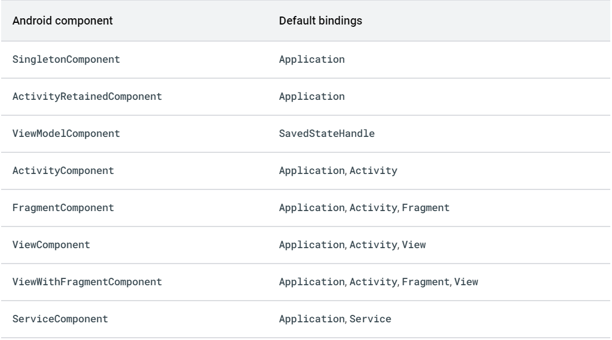
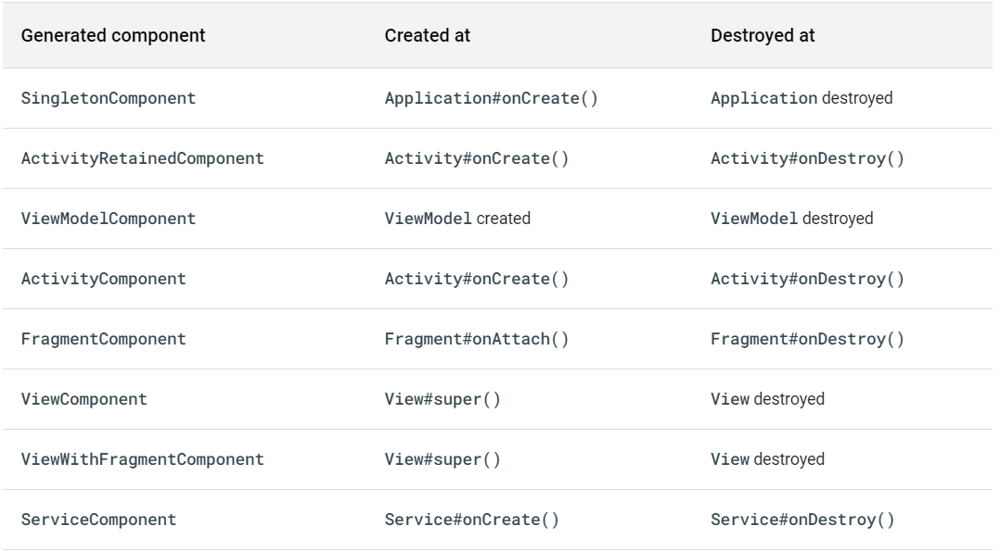
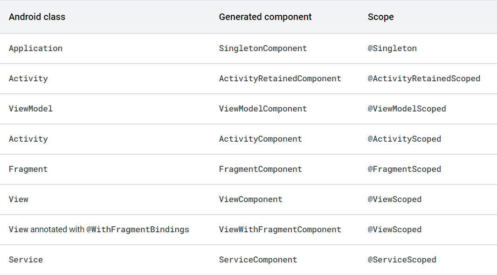
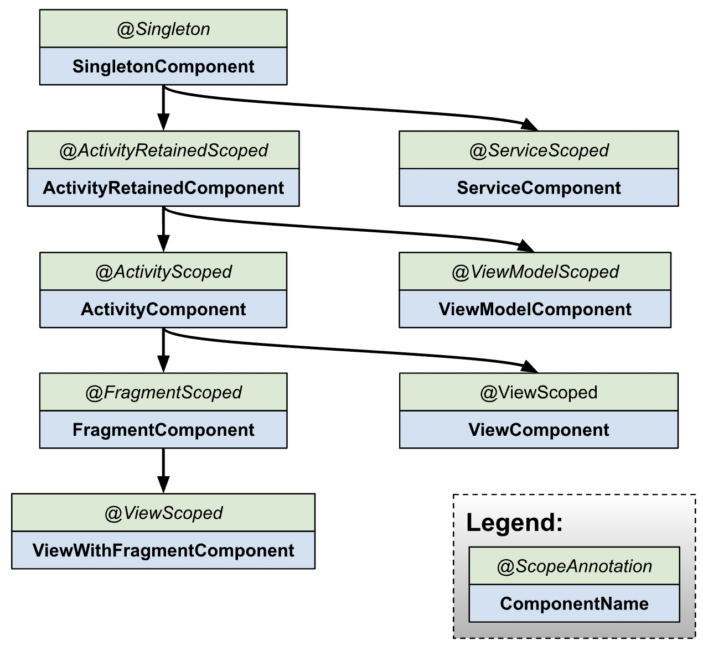

# Hilt

* Example of usage: https://developer.android.com/training/dependency-injection/hilt-android
* Hilt course: https://www.youtube.com/watch?v=WzqHHTks1NE&list=PL0SwNXKJbuNkYFUda5rlA-odAVyWItRCP&index=7

## Basics

* **Hilt** is a dependency injection library for Android that reduces the boilerplate of doing manual dependency injection in your project. 

---

## Hilt application class

* **@HiltAndroidApp** - annotation for marking the android.app.Application class where the Dagger components should be generated. **@HiltAndroidApp** triggers Hilt's code generation, including a base class for your application that serves as the application-level dependency container.

* At build time, Hilt generates Dagger components for Android classes.

---

## Inject dependencies into Android classes

* **@AndroidEntryPoint** - marks an Android component class to be setup for injection with the standard Hilt Dagger Android components. Currently, this supports activities, fragments, views, services, and broadcast receivers.
This annotation will generate a base class that the annotated class should extend, either directly or via the Hilt Gradle Plugin. This base class will take care of injecting members into the Android class as well as handling instantiating the proper Hilt components at the right point in the lifecycle. The name of the base class will be "Hilt_ ".

* If you annotate an Android class with **@AndroidEntryPoint**, then you also must annotate Android classes that depend on it. For example, if you annotate a fragment, then you must also annotate any activities where you use that fragment.

* The following exceptions apply to Hilt support for Android classes:
    * Hilt only supports activities that extend ComponentActivity, such as AppCompatActivity.
    * Hilt only supports fragments that extend androidx.Fragment.
    * Hilt does not support retained fragments.

---

* To obtain dependencies from a component, use the **@Inject** annotation to perform field injection.

---

## Hilt modules

* A Hilt module is a class that is annotated with **@Module**. Like a Dagger module, it informs Hilt how to provide instances of certain types. 

---

* **@InstallIn** - an annotation that declares which component(s) the annotated class should be included in when Hilt generates the components. This may only be used with classes annotated with **@dagger.Module** or **@EntryPoint**. You must annotate Hilt modules with **@InstallIn** to tell Hilt which Android class each module will be used or installed in.

---

* The **@Binds** annotation tells Hilt which implementation to use when it needs to provide an instance of an interface.

* The annotated function provides the following information to Hilt:
    * The function return type tells Hilt what interface the function provides instances of.
    * The function parameter tells Hilt which implementation to provide.

* **@Provides** -  the annotated function supplies the following information to Hilt:
    * The function return type tells Hilt what type the function provides instances of.
    * The function parameters tell Hilt the dependencies of the corresponding type.
    * The function body tells Hilt how to provide an instance of the corresponding type. Hilt executes the function body every time it needs to provide an instance of that type.

---

* In cases where you need Hilt to provide different implementations of the same type as dependencies, you must provide Hilt with multiple bindings. You can define multiple bindings for the same type with **@Qualifier** annotation.

* Hilt provides some predefined qualifiers. For example, as you might need the Context class from either the application or the activity, Hilt provides the **@ApplicationContext** and **@ActivityContext** qualifiers.

---

## Generated components for Android classes

* For each Android class in which you can perform field injection, there's an associated Hilt component that you can refer to in the **@InstallIn** annotation. Each Hilt component is responsible for injecting its bindings into the corresponding Android class.

Hilt provides the following components:

> Figure 1. Generated components for Android classes.

* Hilt doesn't generate a component for broadcast receivers because Hilt injects broadcast receivers directly from **SingletonComponent**.

---

* Hilt automatically creates and destroys instances of generated component classes following the lifecycle of the corresponding Android classes.

> Figure 2. Component lifetimes.

* ActivityRetainedComponent lives across configuration changes, so it is created at the first **Activity#onCreate()** and destroyed at the last **Activity#onDestroy()**.

---

* By default, all bindings in Hilt are **unscoped**. This means that each time your app requests the binding, Hilt creates a new instance of the needed type.

* However, Hilt also allows a binding to be scoped to a particular component. Hilt only creates a scoped binding once per instance of the component that the binding is scoped to, and all requests for that binding share the same instance.

* The table below lists scope annotations for each generated component:

> Figure 3. Component scopes.

* Scoping a binding to a component can be costly because the provided object stays in memory until that component is destroyed. Minimize the use of scoped bindings in your application. It is appropriate to use component-scoped bindings for bindings with an internal state that requires that same instance to be used within a certain scope, for bindings that need synchronization, or for bindings that you have measured to be expensive to create.

---

## Component hierarchy

> Figure 4. Hierarchy of the components that Hilt generates.

---

## Component default bindings

> Figure 5. Component default bindings.

---

## Inject dependencies in classes not supported by Hilt

* Hilt comes with support for the most common Android classes. However, you might need to perform field injection in classes that Hilt doesn't support.

* In those cases, you can create an entry point using the **@EntryPoint** annotation. An entry point is the boundary between code that is managed by Hilt and code that is not. It is the point where code first enters into the graph of objects that Hilt manages. Entry points allow Hilt to use code that Hilt does not manage to provide dependencies within the dependency graph.

* **@EntryPoint** - annotation for marking an interface as an entry point into a generated component. This annotation must be used with **@InstallIn** to indicate which component(s) should have this entry point. When assembling components, Hilt will make the indicated components extend the interface marked with this annotation.

* To access an entry point, use the appropriate static method from **EntryPointAccessors**. The parameter should be either the component instance or the **@AndroidEntryPoint** object that acts as the component holder. Make sure that the component you pass as a parameter and the **EntryPointAccessors** static method both match the Android class in the **@InstallIn** annotation on the **@EntryPoint** interface.

* You must use the **ApplicationContext** to retrieve the entry point if the entry point is installed in **SingletonComponent**. If the binding that you wanted to retrieve were in the **ActivityComponent**, you would instead use the **ActivityContext**.

---

## Hilt and Dagger

* Hilt reduces the boilerplate code that is involved in using Dagger in an Android application. Hilt automatically generates and provides the following:
    * **Components for integrating Android framework classes** with Dagger that you would otherwise need to create by hand.
    * **Scope annotations** to use with the components that Hilt generates automatically.
    * **Predefined bindings** to represent Android classes such as Application or Activity.
    * **Predefined qualifiers** to represent **@ApplicationContext** and **@ActivityContext**.

---

## Hilt in multi-module apps 

* If your multi-module project is composed of regular Gradle modules, then you can use Hilt as described in Dependency injection with Hilt. However, this is not the case with apps that include feature modules.

* In feature modules, the way that modules usually depend on each other is inverted. Therefore, Hilt cannot process annotations in feature modules.

---

## Inject ViewModel objects with Hilt

* **@HiltViewModel** - identifies a **androidx.lifecycle.ViewModel** for construction injection.
The ViewModel annotated with **HiltViewModel** will be available for creation by the **dagger.hilt.android.lifecycle.HiltViewModelFactory** and can be retrieved by default in an Activity or Fragment annotated with **dagger.hilt.android.AndroidEntryPoint**. The HiltViewModel containing a constructor annotated with **javax.inject.Inject** will have its dependencies defined in the constructor parameters injected by Dagger's Hilt.

* Exactly one constructor in the ViewModel must be annotated with **Inject**.

* **@ViewModelScoped** - scope annotation for bindings that should exist for the life of a a single **androidx.lifecycle.ViewModel**.
Use this scope annotation when you want to define a dependency in the **dagger.hilt.android.components.ViewModelComponent** for which a single instance will be provided across all other dependencies for a single dagger.**hilt.android.lifecycle.HiltViewModel**-annotated ViewModel. Other ViewModels that request the scoped dependency will receive a different instance. For sharing the same instance of a dependency across all ViewModels use a scope from one of the parent components of **dagger.hilt.android.components.ViewModelComponent**, such as **javax.inject.Singleton** or **ActivityRetainedScoped**.

* If your ViewModel is scoped to the navigation graph, use the **hiltNavGraphViewModels** function that works with fragments that are annotated with **@AndroidEntryPoint**.