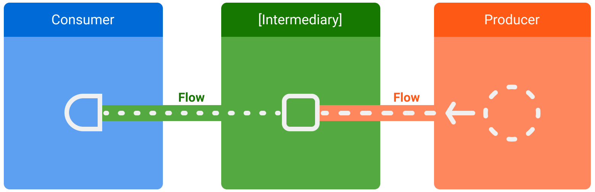

# Flows

* Kotlin flows on Android. Documentation: https://developer.android.com/kotlin/flow
* Kotlin Flows in practice: https://www.youtube.com/watch?v=fSB6_KE95bU
* Migrating from LiveData to Coroutines Flow: https://www.youtube.com/watch?v=i4vfklDGn_o&t=1327s
* Testing flows: https://developer.android.com/kotlin/flow/test
* Things to know about Flow’s shareIn and stateIn operators: https://medium.com/androiddevelopers/things-to-know-about-flows-sharein-and-statein-operators-20e6ccb2bc74
* A safer way to collect flows from Android UIs: https://medium.com/androiddevelopers/a-safer-way-to-collect-flows-from-android-uis-23080b1f8bda
* Live data, Flow, Shared flow & State flow: https://logidots.com/insights/live-data-flow-shared-flow-state-flow-2/
* Kotlin Coroutines Flow. StateFlow. SharedFlow: https://www.youtube.com/watch?v=O0_5gc24KUo&list=PL0SwNXKJbuNmsKQW9mtTSxNn00oJlYOLA&index=8

---

## Overview

* In coroutines, a **flow** is a type that can emit multiple values sequentially, as opposed to suspend functions that return only a single value. For example, you can use a flow to receive live updates from a database.

* Flows are built on top of coroutines and can provide multiple values. A flow is conceptually a **stream of data** that can be computed asynchronously. The emitted values must be of the same type. For example, a `Flow<Int>` is a flow that emits integer values.

* A flow is very similar to an `Iterator` that produces a sequence of values, but it uses suspend functions to produce and consume values asynchronously. This means, for example, that the flow can safely make a network request to produce the next value without blocking the main thread.

* There are three entities involved in streams of data:
  * A **producer** produces data that is added to the stream. Thanks to coroutines, flows can also produce data asynchronously.
  * **(Optional) Intermediaries** can modify each value emitted into the stream or the stream itself. 
  * A **consumer** consumes the values from the stream.


> Figure 1. Entities involved in streams of data: consumer, optional intermediaries, and producer.

---

## Creating a flow

* To create flows, use the **flow builder** APIs. The `flow` builder function creates a new flow where you can manually emit new values into the stream of data using the **emit** function.

* In the following example, a data source fetches the latest news automatically at a fixed interval. As a suspend function cannot return multiple consecutive values, the data source creates and returns a flow to fulfill this requirement. In this case, the data source acts as the producer.

```
class NewsRemoteDataSource(
    private val newsApi: NewsApi,
    private val refreshIntervalMs: Long = 5000
) {
    val latestNews: Flow<List<ArticleHeadline>> = flow {
        while(true) {
            val latestNews = newsApi.fetchLatestNews()
            emit(latestNews) // Emits the result of the request to the flow
            delay(refreshIntervalMs) // Suspends the coroutine for some time
        }
    }
}

// Interface that provides a way to make network requests with suspend functions
interface NewsApi {
    suspend fun fetchLatestNews(): List<ArticleHeadline>
}
```

* The `flow` builder is executed within a coroutine. Thus, it benefits from the same asynchronous APIs, but some restrictions apply:
  * Flows are **sequential**. As the producer is in a coroutine, when calling a suspend function, the producer suspends until the suspend function returns. In the example, the producer suspends until the `fetchLatestNews` network request completes. Only then is the result emitted to the stream. 
  * With the `flow` builder, the producer cannot `emit` values from a different `CoroutineContext`. Therefore, don't call `emit` in a different `CoroutineContext` by creating new coroutines or by using `withContext` blocks of code. You can use other flow builders such as `callbackFlow` in these cases.

---

## Modifying the stream

* Intermediaries can use **intermediate** operators to modify the stream of data without consuming the values. These operators are functions that, when applied to a stream of data, set up a chain of operations that aren't executed until the values are consumed in the future.

```
class NewsRepository(
    private val newsRemoteDataSource: NewsRemoteDataSource,
    private val userData: UserData
) {
    /**
     * Returns the favorite latest news applying transformations on the flow.
     * These operations are lazy and don't trigger the flow. They just transform
     * the current value emitted by the flow at that point in time.
     */
    val favoriteLatestNews: Flow<List<ArticleHeadline>> =
        newsRemoteDataSource.latestNews
            // Intermediate operation to filter the list of favorite topics
            .map { news -> news.filter { userData.isFavoriteTopic(it) } }
            // Intermediate operation to save the latest news in the cache
            .onEach { news -> saveInCache(news) }
}
```

---

## Collecting from a flow

* Use a **terminal** operator to trigger the flow to start listening for values. To get all the values in the stream as they're emitted, use `collect`.

* As `collect` is a suspend function, it needs to be executed within a coroutine. It takes a lambda as a parameter that is called on every new value. Since it's a suspend function, the coroutine that calls `collect` may suspend until the flow is closed.

```
class LatestNewsViewModel(
    private val newsRepository: NewsRepository
) : ViewModel() {

    init {
        viewModelScope.launch {
            // Trigger the flow and consume its elements using collect
            newsRepository.favoriteLatestNews.collect { favoriteNews ->
                // Update View with the latest favorite news
            }
        }
    }
}
```

* Collecting the flow triggers the producer that refreshes the latest news and emits the result of the network request on a fixed interval. As the producer remains always active with the `while(true)` loop, the stream of data will be closed when the ViewModel is cleared and `viewModelScope` is cancelled.

* Flow collection can stop for the following reasons:
  * The coroutine that collects is cancelled, as shown in the previous example. This also stops the underlying producer. 
  * The producer finishes emitting items. In this case, the stream of data is closed and the coroutine that called `collect` resumes execution.

* Flows are **cold** and **lazy** unless specified with other intermediate operators. This means that the producer code is executed each time a terminal operator is called on the flow. In the previous example, having multiple flow collectors causes the data source to fetch the latest news multiple times on different fixed intervals. To optimize and share a flow when multiple consumers collect at the same time, use the `shareIn` operator.

---

## Catching unexpected exceptions

* The implementation of the producer can come from a third party library. This means that it can throw unexpected exceptions. To handle these exceptions, use the `catch` intermediate operator.

```
class LatestNewsViewModel(
    private val newsRepository: NewsRepository
) : ViewModel() {

    init {
        viewModelScope.launch {
            newsRepository.favoriteLatestNews
                // Intermediate catch operator. If an exception is thrown,
                // catch and update the UI
                .catch { exception -> notifyError(exception) }
                .collect { favoriteNews ->
                    // Update View with the latest favorite news
                }
        }
    }
}
```

* In the previous example, when an exception occurs, the `collect` lambda isn't called, as a new item hasn't been received.

* `catch` can also `emit` items to the flow. The example repository layer could `emit` the cached values instead:

```
class NewsRepository(...) {
    val favoriteLatestNews: Flow<List<ArticleHeadline>> =
        newsRemoteDataSource.latestNews
            .map { news -> news.filter { userData.isFavoriteTopic(it) } }
            .onEach { news -> saveInCache(news) }
            // If an error happens, emit the last cached values
            .catch { exception -> emit(lastCachedNews()) }
}
```

* In this example, when an exception occurs, the `collect` lambda is called, as a new item has been emitted to the stream because of the exception.

---

## Executing in a different CoroutineContext

* By default, the producer of a `flow` builder executes in the `CoroutineContext` of the coroutine that collects from it, and as previously mentioned, it cannot `emit` values from a different `CoroutineContext`. This behavior might be undesirable in some cases. For instance, in the examples used throughout this topic, the repository layer shouldn't be performing operations on `Dispatchers.Main` that is used by `viewModelScope`.

* To change the `CoroutineContext` of a flow, use the intermediate operator `flowOn`. `flowOn` changes the `CoroutineContext` of the upstream flow, meaning the producer and any intermediate operators applied before (or above) `flowOn`. The downstream flow (the intermediate operators after `flowOn` along with the consumer) is not affected and executes on the `CoroutineContext` used to collect from the flow. If there are multiple `flowOn` operators, each one changes the upstream from its current location.

```
class NewsRepository(
    private val newsRemoteDataSource: NewsRemoteDataSource,
    private val userData: UserData,
    private val defaultDispatcher: CoroutineDispatcher
) {
    val favoriteLatestNews: Flow<List<ArticleHeadline>> =
        newsRemoteDataSource.latestNews
            .map { news -> // Executes on the default dispatcher
                news.filter { userData.isFavoriteTopic(it) }
            }
            .onEach { news -> // Executes on the default dispatcher
                saveInCache(news)
            }
            // flowOn affects the upstream flow ↑
            .flowOn(defaultDispatcher)
            // the downstream flow ↓ is not affected
            .catch { exception -> // Executes in the consumer's context
                emit(lastCachedNews())
            }
}
```

* With this code, the `onEach` and `map` operators use the `defaultDispatcher`, whereas the `catch` operator and the consumer are executed on `Dispatchers.Main` used by `viewModelScope`.

* As the data source layer is doing I/O work, you should use a dispatcher that is optimized for I/O operations:

```
class NewsRemoteDataSource(
    ...,
    private val ioDispatcher: CoroutineDispatcher
) {
    val latestNews: Flow<List<ArticleHeadline>> = flow {
        // Executes on the IO dispatcher
        ...
    }
        .flowOn(ioDispatcher)
}
```

---

## Flows in Jetpack libraries

* Flow is integrated into many Jetpack libraries, and it's popular among Android third party libraries. Flow is a great fit for live data updates and endless streams of data.

* You can use **Flow with Room** to be notified of changes in a database. When using **data access objects (DAO)**, return a `Flow` type to get live updates.

```
@Dao
abstract class ExampleDao {
    @Query("SELECT * FROM Example")
    abstract fun getExamples(): Flow<List<Example>>
}
```

* Every time there's a change in the `Example` table, a new list is emitted with the new items in the database.

```
class FirestoreUserEventsDataSource(
    private val firestore: FirebaseFirestore
) {
    // Method to get user events from the Firestore database
    fun getUserEvents(): Flow<UserEvents> = callbackFlow {

        // Reference to use in Firestore
        var eventsCollection: CollectionReference? = null
        try {
            eventsCollection = FirebaseFirestore.getInstance()
                .collection("collection")
                .document("app")
        } catch (e: Throwable) {
            // If Firebase cannot be initialized, close the stream of data
            // flow consumers will stop collecting and the coroutine will resume
            close(e)
        }

        // Registers callback to firestore, which will be called on new events
        val subscription = eventsCollection?.addSnapshotListener { snapshot, _ ->
            if (snapshot == null) { return@addSnapshotListener }
            // Sends events to the flow! Consumers will get the new events
            try {
                offer(snapshot.getEvents())
            } catch (e: Throwable) {
                // Event couldn't be sent to the flow
            }
        }

        // The callback inside awaitClose will be executed when the flow is
        // either closed or cancelled.
        // In this case, remove the callback from Firestore
        awaitClose { subscription?.remove() }
    }
}
```

* Unlike the `flow` builder, `callbackFlow` allows values to be emitted from a different `CoroutineContext` with the `send` function or outside a coroutine with the `offer` function. 

* Internally, `callbackFlow` uses a **channel**, which is conceptually very similar to a blocking **queue**. A channel is configured with a capacity, the maximum number of elements that can be buffered. The channel created in `callbackFlow` has a default capacity of 64 elements. When you try to add a new element to a full channel, `send` suspends the producer until there's space for the new element, whereas `offer` does not add the element to the channel and returns `false` immediately.

---

## StateFlow and SharedFlow

* `StateFlow` and `SharedFlow` are **Flow APIs** that enable flows to optimally emit state updates and emit values to multiple consumers.

### StateFlow

* `StateFlow` is a state-holder observable flow that emits the current and new state updates to its collectors. The current state value can also be read through its `value` property. To update state and send it to the flow, assign a new value to the `value` property of the `MutableStateFlow` class.

* In Android, `StateFlow` is a great fit for classes that need to maintain an observable mutable state.

* Following the examples from **Kotlin flows**, a `StateFlow` can be exposed from the `LatestNewsViewModel` so that the `View` can listen for UI state updates and inherently make the screen state survive configuration changes.

```
class LatestNewsViewModel(
    private val newsRepository: NewsRepository
) : ViewModel() {

    // Backing property to avoid state updates from other classes
    private val _uiState = MutableStateFlow(LatestNewsUiState.Success(emptyList()))
    // The UI collects from this StateFlow to get its state updates
    val uiState: StateFlow<LatestNewsUiState> = _uiState

    init {
        viewModelScope.launch {
            newsRepository.favoriteLatestNews
                // Update View with the latest favorite news
                // Writes to the value property of MutableStateFlow,
                // adding a new element to the flow and updating all
                // of its collectors
                .collect { favoriteNews ->
                    _uiState.value = LatestNewsUiState.Success(favoriteNews)
                }
        }
    }
}

// Represents different states for the LatestNews screen
sealed class LatestNewsUiState {
    data class Success(val news: List<ArticleHeadline>): LatestNewsUiState()
    data class Error(val exception: Throwable): LatestNewsUiState()
}
```

* The class responsible for updating a `MutableStateFlow` is the producer, and all classes collecting from the `StateFlow` are the consumers. Unlike a cold flow built using the `flow` builder, a `StateFlow` is hot: collecting from the flow doesn't trigger any producer code. A `StateFlow` is always active and in memory, and it becomes eligible for garbage collection only when there are no other references to it from a garbage collection root.

* When a new consumer starts collecting from the flow, it receives the last state in the stream and any subsequent states. You can find this behavior in other observable classes like `LiveData`.

* The `View` listens for `StateFlow` as with any other flow:

```
class LatestNewsActivity : AppCompatActivity() {
    private val latestNewsViewModel = // getViewModel()

    override fun onCreate(savedInstanceState: Bundle?) {
        ...
        // Start a coroutine in the lifecycle scope
        lifecycleScope.launch {
            // repeatOnLifecycle launches the block in a new coroutine every time the
            // lifecycle is in the STARTED state (or above) and cancels it when it's STOPPED.
            repeatOnLifecycle(Lifecycle.State.STARTED) {
                // Trigger the flow and start listening for values.
                // Note that this happens when lifecycle is STARTED and stops
                // collecting when the lifecycle is STOPPED
                latestNewsViewModel.uiState.collect { uiState ->
                    // New value received
                    when (uiState) {
                        is LatestNewsUiState.Success -> showFavoriteNews(uiState.news)
                        is LatestNewsUiState.Error -> showError(uiState.exception)
                    }
                }
            }
        }
    }
}
```

> **Warning**: Never collect a flow from the UI directly from **launch** or the **launchIn** extension function if the UI needs to be updated. These functions process events even when the view is not visible. This behavior can lead to app crashes. To avoid that, use the **repeatOnLifecycle** API as shown above.

* To convert any flow to a `StateFlow`, use the `stateIn` intermediate operator.

### StateFlow, Flow, and LiveData

* `StateFlow` and `LiveData` have similarities. Both are observable data holder classes, and both follow a similar pattern when used in your app architecture.

* Note, however, that `StateFlow` and `LiveData` do behave differently:
  * `StateFlow` requires an initial state to be passed in to the constructor, while `LiveData` does not.
  * `LiveData.observe()` automatically unregisters the consumer when the view goes to the `STOPPED` state, whereas collecting from a `StateFlow` or any other flow does not stop collecting automatically. To achieve the same behavior,you need to collect the flow from a `Lifecycle.repeatOnLifecycle` block.

### Making cold flows hot using shareIn

* `StateFlow` is a hot flow—it remains in memory as long as the flow is collected or while any other references to it exist from a garbage collection root. You can turn cold flows hot by using the `shareIn` operator.

* Using the `callbackFlow` created in **Kotlin flows** as an example, instead of having each collector create a new flow, you can share the data retrieved from Firestore between collectors by using `shareIn`. You need to pass in the following:
  * A `CoroutineScope` that is used to share the flow. This scope should live longer than any consumer to keep the shared flow alive as long as needed. 
  * The number of items to replay to each new collector. 
  * The start behavior policy.

```
class NewsRemoteDataSource(...,
    private val externalScope: CoroutineScope,
) {
    val latestNews: Flow<List<ArticleHeadline>> = flow {
        ...
    }.shareIn(
        externalScope,
        replay = 1,
        started = SharingStarted.WhileSubscribed()
    )
}
```

* In this example, the `latestNews` flow replays the last emitted item to a new collector and remains active as long as `externalScope` is alive and there are active collectors. The `SharingStarted.WhileSubscribed()` start policy keeps the upstream producer active while there are active subscribers. Other start policies are available, such as `SharingStarted.Eagerly` to start the producer immediately or `SharingStarted.Lazily` to start sharing after the first subscriber appears and keep the flow active forever.

### SharedFlow

* The `shareIn` function returns a `SharedFlow`, a hot flow that emits values to all consumers that collect from it. A `SharedFlow` is a highly-configurable generalization of `StateFlow`.

* You can create a `SharedFlow` without using `shareIn`. As an example, you could use a `SharedFlow` to send ticks to the rest of the app so that all the content refreshes periodically at the same time. Apart from fetching the latest news, you might also want to refresh the user information section with its favorite topics collection. In the following code snippet, a `TickHandler` exposes a `SharedFlow` so that other classes know when to refresh its content. As with `StateFlow`, use a backing property of type `MutableSharedFlow` in a class to send items to the flow:

```
// Class that centralizes when the content of the app needs to be refreshed
class TickHandler(
    private val externalScope: CoroutineScope,
    private val tickIntervalMs: Long = 5000
) {
    // Backing property to avoid flow emissions from other classes
    private val _tickFlow = MutableSharedFlow<Unit>(replay = 0)
    val tickFlow: SharedFlow<Event<String>> = _tickFlow

    init {
        externalScope.launch {
            while(true) {
                _tickFlow.emit(Unit)
                delay(tickIntervalMs)
            }
        }
    }
}

class NewsRepository(
    ...,
    private val tickHandler: TickHandler,
    private val externalScope: CoroutineScope
) {
    init {
        externalScope.launch {
            // Listen for tick updates
            tickHandler.tickFlow.collect {
                refreshLatestNews()
            }
        }
    }

    suspend fun refreshLatestNews() { ... }
    ...
}
```

* You can customize the `SharedFlow` behavior in the following ways:
  * `replay` lets you resend a number of previously-emitted values for new subscribers.
  * `onBufferOverflow` lets you specify a policy for when the buffer is full of items to be sent. The default value is `BufferOverflow.SUSPEND`, which makes the caller suspend. Other options are `DROP_LATEST` or `DROP_OLDEST`.


