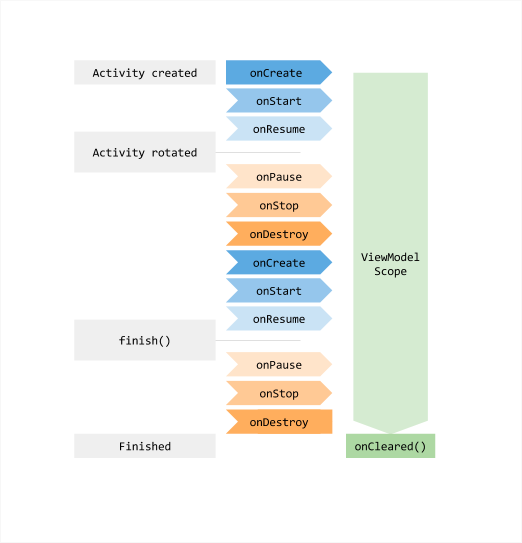
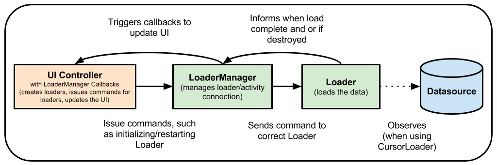
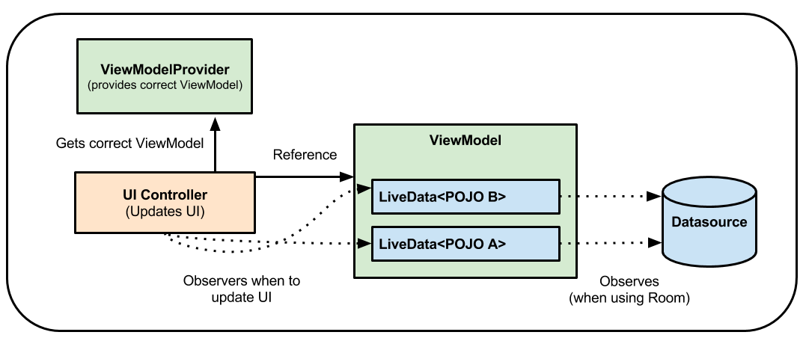
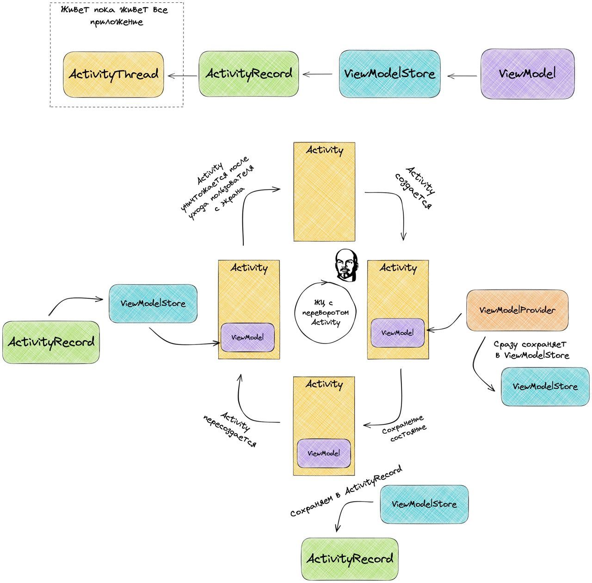

# ViewModel

* Documentation: https://developer.android.com/topic/libraries/architecture/viewmodel
* Android Jetpack: ViewModel: https://www.youtube.com/watch?v=5qlIPTDE274&t=30s
* ViewModels: Persistence, onSaveInstanceState(), Restoring UI State and Loaders: https://medium.com/androiddevelopers/viewmodels-persistence-onsaveinstancestate-restoring-ui-state-and-loaders-fc7cc4a6c090
* ViewModels with Saved State, Jetpack Navigation, Data Binding and Coroutines: https://medium.com/androiddevelopers/viewmodels-with-saved-state-jetpack-navigation-data-binding-and-coroutines-df476b78144e
* How ViewModels survive configuration changes: https://arkadiuszchmura.com/posts/how-viewmodels-survive-configuration-changes/


## Basics

* The **ViewModel** class is designed to store and manage UI-related data in a lifecycle conscious way. The **ViewModel** class allows data to survive configuration changes such as screen rotations.

* The Android framework manages the lifecycle of UI controllers, such as activities and fragments. The framework may decide to destroy or re-create a UI controller in response to certain user actions or device events that are completely out of your control.

* If the system destroys or re-creates a UI controller, any transient UI-related data you store in them is lost. For example, your app may include a list of users in one of its activities. When the activity is re-created for a configuration change, the new activity has to re-fetch the list of users. For simple data, the activity can use the **onSaveInstanceState()** method and restore its data from the bundle in **onCreate()**, but this approach is only suitable for small amounts of data that can be serialized then deserialized, not for potentially large amounts of data like a list of users or bitmaps.

* Another problem is that UI controllers frequently need to make asynchronous calls that may take some time to return. The UI controller needs to manage these calls and ensure the system cleans them up after it's destroyed to avoid potential memory leaks. This management requires a lot of maintenance, and in the case where the object is re-created for a configuration change, it's a waste of resources since the object may have to reissue calls it has already made.

* UI controllers such as activities and fragments are primarily intended to display UI data, react to user actions, or handle operating system communication, such as permission requests. Requiring UI controllers to also be responsible for loading data from a database or network adds bloat to the class. Assigning excessive responsibility to UI controllers can result in a single class that tries to handle all of an app's work by itself, instead of delegating work to other classes. Assigning excessive responsibility to the UI controllers in this way also makes testing a lot harder.

* It's easier and more efficient to separate out view data ownership from UI controller logic.

---

## Implement a ViewModel

* Architecture Components provides **ViewModel** helper class for the UI controller that is responsible for preparing data for the UI. **ViewModel** objects are automatically retained during configuration changes so that data they hold is immediately available to the next activity or fragment instance. For example, if you need to display a list of users in your app, make sure to assign responsibility to acquire and keep the list of users to a **ViewModel**, instead of an activity or fragment, as illustrated by the following sample code:

```
class MyViewModel : ViewModel() {
    private val users: MutableLiveData<List<User>> by lazy {
        MutableLiveData<List<User>>().also {
            loadUsers()
        }
    }

    fun getUsers(): LiveData<List<User>> {
        return users
    }

    private fun loadUsers() {
        // Do an asynchronous operation to fetch users.
    }
}
```

* You can then access the list from an activity as follows:

```
class MyActivity : AppCompatActivity() {

    override fun onCreate(savedInstanceState: Bundle?) {
        // Create a ViewModel the first time the system calls an activity's onCreate() method.
        // Re-created activities receive the same MyViewModel instance created by the first activity.

        // Use the 'by viewModels()' Kotlin property delegate
        // from the activity-ktx artifact
        val model: MyViewModel by viewModels()
        model.getUsers().observe(this, Observer<List<User>>{ users ->
            // update UI
        })
    }
}
```

* If the activity is re-created, it receives the same **MyViewModel** instance that was created by the first activity. When the owner activity is finished, the framework calls the **ViewModel** objects's **onCleared()** method so that it can clean up resources.

> **Caution:** A ViewModel must never reference a view, **Lifecycle**, or any class that may hold a reference to the activity context.

* **ViewModel** objects are designed to outlive specific instantiations of views or **LifecycleOwners**. This design also means you can write tests to cover a **ViewModel** more easily as it doesn't know about view and **Lifecycle** objects. **ViewModel** objects can contain **LifecycleObservers**, such as **LiveData** objects. However **ViewModel** objects must never observe changes to lifecycle-aware observables, such as **LiveData** objects. If the **ViewModel** needs the **Application** context, for example to find a system service, it can extend the **AndroidViewModel** class and have a constructor that receives the **Application** in the constructor, since **Application** class extends **Context**.

---

## Create ViewModels with dependencies

* Following **dependency injection's** best practices, ViewModels can take dependencies as parameters in their constructor. These are mostly of types from the **domain** or **data** layers. Because the framework provides the ViewModels, a special mechanism is required to create instances of them. That mechanism is the **ViewModelProvider.Factory** interface. Only **implementations of this interface can instantiate ViewModels in the right scope**.

> **Note:** If the ViewModel takes no dependencies or just the **SavedStateHandle type as a dependency**, you do not need to provide a factory for the framework to instantiate instances of that ViewModel type.

> **Note:** When **injecting ViewModels using Hilt** as a dependency injection solution, you don't have to define a ViewModel factory manually. Hilt generates a factory that knows how to create all ViewModels annotated with **@HiltViewModel** for you at compile time. Classes annotated with **@AndroidEntryPoint** can directly access the Hilt generated factory when calling the regular ViewModel APIs.

* If a ViewModel class receives dependencies in its constructor, provide a factory that implements the **ViewModelProvider.Factory** interface. Override the **create(Class<T>, CreationExtras)** function to provide a new instance of the ViewModel.

* **CreationExtras** allows you to access relevant information that helps instantiate a ViewModel. Here's a list of keys that can be accessed from extras:

| Key                                                       | Functionality                                                                                          |
|-----------------------------------------------------------|--------------------------------------------------------------------------------------------------------|
| ViewModelProvider.NewInstanceFactory.VIEW_MODEL_KEY       | This **Key** provides access to the custom key you passed to **ViewModelProvider.get()**.              |
| ViewModelProvider.AndroidViewModelFactory.APPLICATION_KEY | Provides access to the instance of the **Application** class.                                          |
| SavedStateHandleSupport.DEFAULT_ARGS_KEY                  | Provides access to the Bundle of arguments you should use to construct a **SavedStateHandle**.         |
| SavedStateHandleSupport.SAVED_STATE_REGISTRY_OWNER_KEY    | Provides access to the **SavedStateRegistryOwner** that is being used to construct the **ViewModel**.  |
| SavedStateHandleSupport.VIEW_MODEL_STORE_OWNER_KEY        | Provides access to the **ViewModelStoreOwner** that is being used to construct the **ViewModel**.      |

* To create a new instance of **SavedStateHandle**, use the **CreationExtras.createSavedStateHandle()**.createSavedStateHandle()) function and pass it to the ViewModel.

* The following is an example of how to provide an instance of a ViewModel that takes a repository scoped to the **Application** class and **SavedStateHandle** as dependencies:

```
import androidx.lifecycle.SavedStateHandle
import androidx.lifecycle.ViewModel
import androidx.lifecycle.ViewModelProvider
import androidx.lifecycle.ViewModelProvider.AndroidViewModelFactory.Companion.APPLICATION_KEY
import androidx.lifecycle.createSavedStateHandle
import androidx.lifecycle.viewmodel.CreationExtras

class MyViewModel(
    private val myRepository: MyRepository,
    private val savedStateHandle: SavedStateHandle
) : ViewModel() {

    // ViewModel logic
    // ...

    // Define ViewModel factory in a companion object
    companion object {

        val Factory: ViewModelProvider.Factory = object : ViewModelProvider.Factory {
            @Suppress("UNCHECKED_CAST")
            override fun <T : ViewModel> create(
                modelClass: Class<T>,
                extras: CreationExtras
            ): T {
                // Get the Application object from extras
                val application = checkNotNull(extras[APPLICATION_KEY])
                // Create a SavedStateHandle for this ViewModel from extras
                val savedStateHandle = extras.createSavedStateHandle()

                return MyViewModel(
                    (application as MyApplication).myRepository,
                    savedStateHandle
                ) as T
            }
        }
    }
}
```

> **Note:** It's a good practice to place ViewModel factories in their ViewModel file for better context, readability, and easier discovery. The same ViewModel factory can be used for multiple ViewModels when they share dependencies, as it's the case for the [Architecture Blueprints](https://github.com/android/architecture-samples/blob/views/app/src/main/java/com/example/android/architecture/blueprints/todoapp/ViewModelFactory.kt) sample.

* Then, you can use this factory when retrieving an instance of the ViewModel:

```
import androidx.activity.viewModels

class MyActivity : AppCompatActivity() {

    private val viewModel: MyViewModel by viewModels { MyViewModel.Factory }

    // Rest of Activity code
}
```

* Alternatively, use the ViewModel factory DSL to create factories using a more idiomatic Kotlin API:

```
import androidx.lifecycle.SavedStateHandle
import androidx.lifecycle.ViewModel
import androidx.lifecycle.ViewModelProvider
import androidx.lifecycle.ViewModelProvider.AndroidViewModelFactory.Companion.APPLICATION_KEY
import androidx.lifecycle.createSavedStateHandle
import androidx.lifecycle.viewmodel.initializer
import androidx.lifecycle.viewmodel.viewModelFactory

class MyViewModel(
    private val myRepository: MyRepository,
    private val savedStateHandle: SavedStateHandle
) : ViewModel() {
    // ViewModel logic

    // Define ViewModel factory in a companion object
    companion object {
        val Factory: ViewModelProvider.Factory = viewModelFactory {
            initializer {
                val savedStateHandle = createSavedStateHandle()
                val myRepository = (this[APPLICATION_KEY] as MyApplication).myRepository
                MyViewModel(
                    myRepository = myRepository,
                    savedStateHandle = savedStateHandle
                )
            }
        }
    }
}
```

### Factories for ViewModel version older than 2.5.0

* If you're using a version of ViewModel older than 2.5.0, you need to provide factories from a subset of classes that extend **ViewModelProvider.Factory** and implement the **create(Class<T>)** function. Depending on what dependencies the ViewModel needs, a different class needs to be extended from:
  * **AndroidViewModelFactory** if the **Application** class is needed.
  * **AbstractSavedStateViewModelFactory** if **SavedStateHandle** needs to be passed as a dependency.

* If **Application** or **SavedStateHandle** aren't needed, simply extend from **ViewModelProvider.Factory**.

The following example uses an **AbstractSavedStateViewModelFactory** for a ViewModel that takes a repository and a **SavedStateHandle** type as a dependency:

```
class MyViewModel(
    private val myRepository: MyRepository,
    private val savedStateHandle: SavedStateHandle
) : ViewModel() {

    // ViewModel logic ...

    // Define ViewModel factory in a companion object
    companion object {
        fun provideFactory(
            myRepository: MyRepository,
            owner: SavedStateRegistryOwner,
            defaultArgs: Bundle? = null,
        ): AbstractSavedStateViewModelFactory =
            object : AbstractSavedStateViewModelFactory(owner, defaultArgs) {
                @Suppress("UNCHECKED_CAST")
                override fun <T : ViewModel> create(
                    key: String,
                    modelClass: Class<T>,
                    handle: SavedStateHandle
                ): T {
                    return MyViewModel(myRepository, handle) as T
                }
            }
    }
}
```

> **Warning:** if you're using a version of **ViewModel** older than 2.5.0, you might have the option to override a create function with **CreationExtras** in its signature. Don't override that function. Instead, override the **create** function that has the **key**, **modelClass** and **savedStateHandle** parameters.

* Then, you can use factory to retrieve your **ViewModel**:

import androidx.activity.viewModels

```
class MyActivity : AppCompatActivity() {

    private val viewModel: MyViewModel by viewModels {
        MyViewModel.provideFactory((application as MyApplication).myRepository, this)
    }

    // Rest of Activity code
}
```

---

## The lifecycle of a ViewModel

* **ViewModel** objects are scoped to the **Lifecycle** of the **ViewModelStoreOwner** passed to the **ViewModelProvider** when getting the **ViewModel**. The **ViewModel** remains in memory until the **ViewModelStoreOwner** it's scoped to goes away permanently:
  * In the case of an activity, when it finishes.
  * In the case of a fragment, when it's detached.
  * In the case of a Navigation entry, when it's removed from the back stack.
  
* This makes ViewModels a great solution for storing data that survives configuration changes.

* Figure 1 illustrates the various lifecycle states of an activity as it undergoes a rotation and then is finished. The illustration also shows the lifetime of the **ViewModel** next to the associated activity lifecycle. This particular diagram illustrates the states of an activity. The same basic states apply to the lifecycle of a fragment.


> Figure 1. The lifecycle of a ViewModel.

* You usually request a **ViewModel** the first time the system calls an activity object's **onCreate()** method. The system may call **onCreate()** several times throughout the life of an activity, such as when a device screen is rotated. The **ViewModel** exists from when you first request a **ViewModel** until the activity is finished and destroyed.

> **Key Point:** Calls to **ViewModelProvider** with a particular **ViewModelStoreOwner** always return the same instance of the ViewModel until the owner goes away permanently.

---

## ViewModel APIs

* The **ViewModelProvider.get()** method lets you obtain an instance of a ViewModel scoped to any **ViewModelStoreOwner**. For Kotlin users, there are different extension functions available for the most common use cases. All Kotlin extension function implementations use the ViewModelProvider API under the hood.

### ViewModels scoped to the closest ViewModelStoreOwner

* You can scope a ViewModel to an Activity, Fragment, or destination of a Navigation graph. The **viewModels()** extension functions provided by the Activity, Fragment and Navigation libraries, and the **viewModel()** function in Compose allows you to get an instance of the ViewModel scoped to the closest ViewModelStoreOwner.

```
class MyActivity : AppCompatActivity() {

    // ViewModel API available in activity.activity-ktx
    // The ViewModel is scoped to `this` Activity
    val viewModel: MyViewModel by viewModels()
}

class MyFragment : Fragment() {

    // ViewModel API available in fragment.fragment-ktx
    // The ViewModel is scoped to `this` Fragment
    val viewModel: MyViewModel by viewModels()
}
```

> **Note:** if you're using Hilt and Jetpack Compose, replace the **viewModel()** calls with **hiltViewModel()** as explained in the Compose + Hilt documentation.

### ViewModels scoped to any ViewModelStoreOwner

* The **ComponentActivity.viewModels()** and **Fragment.viewModels()** functions in the View system and the **viewModel()** function in Compose take an optional **ownerProducer** parameter that you can use to specify to which **ViewModelStoreOwner** the instance of the ViewModel is scoped to. The following sample shows how to get an instance of a ViewModel scoped to the parent fragment:

```
class MyFragment : Fragment() {

    // ViewModel API available in fragment.fragment-ktx
    // The ViewModel is scoped to the parent of `this` Fragment
    val viewModel: SharedViewModel by viewModels(
        ownerProducer = { requireParentFragment() }
    )
}
```

* As getting an Activity-scoped ViewModel from a Fragment can be a common use case in your app, the **activityViewModels()** Views extension function is available. If you're not using Views and Kotlin, you can use the same APIs as above and passing the right owner.

```
class MyFragment : Fragment() {

    // ViewModel API available in fragment.fragment-ktx
    // The ViewModel is scoped to the host Activity
    val viewModel: SharedViewModel by activityViewModels()
}
```

### ViewModels scoped to the Navigation graph

* Navigation graphs are also ViewModel store owners. If you're using **Navigation Fragment** or **Navigation Compose**, you can get an instance of a ViewModel scoped to a Navigation graph with the **navGraphViewModels(graphId)** Views extension function.

```
class MyFragment : Fragment() {

    // ViewModel API available in navigation.navigation-fragment
    // The ViewModel is scoped to the `nav_graph` Navigation graph
    val viewModel: SharedViewModel by navGraphViewModels(R.id.nav_graph)

    // Equivalent navGraphViewModels code using the viewModels API
    val viewModel: SharedViewModel by viewModels(
        { findNavController().getBackStackEntry(R.id.nav_graph) }
    )
}
```

* If you're using Hilt in addition to Jetpack Navigation, you can use the **hiltNavGraphViewModels(graphId)** API as follows.

```
class MyFragment : Fragment() {

    // ViewModel API available in hilt.hilt-navigation-fragment
    // The ViewModel is scoped to the `nav_graph` Navigation graph
    // and is provided using the Hilt-generated ViewModel factory
    val viewModel: SharedViewModel by hiltNavGraphViewModels(R.id.nav_graph)
}
```

---

## Share data between fragments

* It's very common that two or more fragments in an activity need to communicate with each other. Imagine a common case of split-view (list-detail) fragments, where you have a fragment in which the user selects an item from a list and another fragment that displays the contents of the selected item. This case is never trivial as both fragments need to define some interface description, and the owner activity must bind the two together. In addition, both fragments must handle the scenario where the other fragment is not yet created or visible.

* This common pain point can be addressed by using **ViewModel** objects. These fragments can share a **ViewModel** using their activity scope to handle this communication, as illustrated by the following sample code:

```
class SharedViewModel : ViewModel() {
val selected = MutableLiveData()

    fun select(item: Item) {
        selected.value = item
    }
}

class ListFragment : Fragment() {

    private lateinit var itemSelector: Selector

    // Use the 'by activityViewModels()' Kotlin property delegate
    // from the fragment-ktx artifact
    private val model: SharedViewModel by activityViewModels()

    override fun onViewCreated(view: View, savedInstanceState: Bundle?) {
        super.onViewCreated(view, savedInstanceState)
        itemSelector.setOnClickListener { item ->
            // Update the UI
        }
    }
}

class DetailFragment : Fragment() {

    // Use the 'by activityViewModels()' Kotlin property delegate
    // from the fragment-ktx artifact
    private val model: SharedViewModel by activityViewModels()

    override fun onViewCreated(view: View, savedInstanceState: Bundle?) {
        super.onViewCreated(view, savedInstanceState)
        model.selected.observe(viewLifecycleOwner, Observer { item ->
            // Update the UI
        })
    }
}
```

* Notice that both fragments retrieve the activity that contains them. That way, when the fragments each get the **ViewModelProvider**, they receive the same **SharedViewModel** instance, which is scoped to this activity.

* This approach offers the following benefits:
  * The activity does not need to do anything, or know anything about this communication. 
  * Fragments don't need to know about each other besides the **SharedViewModel** contract. If one of the fragments disappears, the other one keeps working as usual. 
  * Each fragment has its own lifecycle, and is not affected by the lifecycle of the other one. If one fragment replaces the other one, the UI continues to work without any problems.

---

## Replacing Loaders with ViewModel 

* Loader classes like **CursorLoader** are frequently used to keep the data in an app's UI in sync with a database. You can use **ViewModel**, with a few other classes, to replace the loader. Using a **ViewModel** separates your UI controller from the data-loading operation, which means you have fewer strong references between classes.

* In one common approach to using loaders, an app might use a **CursorLoader** to observe the contents of a database. When a value in the database changes, the loader automatically triggers a reload of the data and updates the UI:


> Figure 2. Loading data with loaders.

* **ViewModel** works with **Room** and **LiveData** to replace the loader. The **ViewModel** ensures that the data survives a device configuration change. **Room** informs your **LiveData** when the database changes, and the **LiveData**, in turn, updates your UI with the revised data.


> Figure 3. Loading data with ViewModel.

---

## Use coroutines with ViewModel

* **ViewModel** includes support for Kotlin coroutines.

---

## Further information

* As your data grows more complex, you might choose to have a separate class just to load the data. The purpose of **ViewModel** is to encapsulate the data for a UI controller to let the data survive configuration changes. For information about how to load, persist, and manage data across configuration changes, see Saving UI States.

* The Guide to Android App Architecture suggests building a **repository** class to handle these functions.

---

## How ViewModels survive configuration changes

### Creating a ViewModel

* The recommended approach to create an instance of a `ViewModel` class inside an activity is to use the following code:

```
private val viewModel: MyViewModel by viewModels()
```

* The `viewModels()` function returns a `Lazy<T>` instance, which serves as a lazy property delegate. This basically means that a `MyViewModel` instance is going to be obtained on first access to the `viewModel` variable (not when this variable is declared).

* Here is what the `viewModels()` function looks like:

```
public inline fun <reified VM : ViewModel> ComponentActivity.viewModels(  
    noinline factoryProducer: (() -> Factory)? = null  
): Lazy<VM> {  
    val factoryPromise = factoryProducer ?: {  
        defaultViewModelProviderFactory  
    }
    
    return ViewModelLazy(VM::class, { viewModelStore }, factoryPromise)  
}
```

* It accepts a single parameter - a `factoryProducer`. If it’s specified, the `ViewModelProvider`.Factory returned by this lambda will be used to create a `ViewModel` instance. If not, the default one will be used.

* The function returns an instance of the `ViewModelLazy` class which is an implementation of the `Lazy` interface that I mentioned earlier.

* The `ViewModelLazy`’s constructor takes three parameters. The first one represents a class of the `ViewModel` we want to create an instance of. The third one is a lambda that returns a `ViewModelProvider.Factory`. It’s the same one as the one passed to the viewModels() function (or a default one).

* The second parameter is interesting. It’s a lambda that returns a `ViewModelStore`. Here, a lambda is passed that returns a `viewModelStore` variable. Where is this variable coming from?

* As you can see, the `viewModels()` function is an extension function on the `ComponentActivity` class. So when we call `viewModelStore` in Kotlin, we effectively invoke the `getViewModelStore()` method from the `ComponentActivity` (written in Java) that returns its member variable called `mViewModelStore`:

```
public ViewModelStore getViewModelStore() {
    if (getApplication() == null) {
        throw new IllegalStateException("Your activity is not yet attached to the "
            + "Application instance. You can't request ViewModel before onCreate call.");
    }
    ensureViewModelStore();
    return mViewModelStore;
}
```

* The reason why the `ComponentActivity` has this method is that it implements the `ViewModelStoreOwner` interface. This is its declaration:

```
/**
* A scope that owns {@link ViewModelStore}.
* <p>
* A responsibility of an implementation of this interface is to retain owned ViewModelStore
* during the configuration changes and call {@link ViewModelStore#clear()}, when this scope is
* going to be destroyed.
*
* @see ViewTreeViewModelStoreOwner
*/
@SuppressWarnings("WeakerAccess")
public interface ViewModelStoreOwner {
    /**
    * Returns owned {@link ViewModelStore}
    *
    * @return a {@code ViewModelStore}
    */
    @NonNull
    ViewModelStore getViewModelStore();
}
```

* Now you may ask: “What is `ViewModelStore`?”

* As the name suggests, the `ViewModelStore` class is responsible for **storing** instances of `ViewModels`. This is what this class looks like:

```
public class ViewModelStore {

    private final HashMap<String, ViewModel> mMap = new HashMap<>();

    final void put(String key, ViewModel viewModel) {
        ViewModel oldViewModel = mMap.put(key, viewModel);
        if (oldViewModel != null) {
            oldViewModel.onCleared();
        }
    }

    final ViewModel get(String key) {
        return mMap.get(key);
    }

    Set<String> keys() {
        return new HashSet<>(mMap.keySet());
    }

    public final void clear() {
        for (ViewModel vm : mMap.values()) {
            vm.clear();
        }
        mMap.clear();
    }
}
```

* This relatively simple class serves as a wrapper around `HashMap<String, ViewModel>`. This is the ultimate place where all `ViewModels` associated with an activity or a fragment are stored.

* Now, since we know what the `ViewModelStore` is, it’s clear what the `ViewModelStoreOwner` interface is used for. A class that implements it indicates to the outside world that it owns an instance of the `ViewModelStore`.

* This is a list of all classes in the Android framework that implement the `getViewModelStore()` method from the `ViewModelStoreOwner` interface. Basically, it’s only activities and fragments.


> Figure 4. Classes that implement `getViewModelStore()` from the `ViewModelStoreOwner`.

> A responsibility of an implementation of this interface is to retain owned `ViewModelStore` during the configuration changes and call `ViewModelStore#clear()`, when this scope is going to be destroyed.

* This gives us a valuable hint. It means that it’s the **activity’s (or fragment’s) responsibility** to make sure that its `ViewModelStore` (along with all `ViewModels`) is preserved across configuration changes.

* How do activities handle that? We will come back to this question in the next section.

* For now, let’s go back again to the `viewModels()` function and see what the newly constructed `ViewModelLazy` class looks like:

```
public class ViewModelLazy<VM : ViewModel> (
    private val viewModelClass: KClass<VM>,
    private val storeProducer: () -> ViewModelStore,
    private val factoryProducer: () -> ViewModelProvider.Factory
) : Lazy<VM> {
private var cached: VM? = null

    override val value: VM
        get() {
            val viewModel = cached
            return if (viewModel == null) {
                val factory = factoryProducer()
                val store = storeProducer()
                ViewModelProvider(store, factory).get(viewModelClass.java).also {
                    cached = it
                }
            } else {
                viewModel
            }
        }

    override fun isInitialized(): Boolean = cached != null
}
```

* Most of the code in this class just deals with caching the object and making sure that the same instance is returned on subsequent calls.

* The most relevant fragment is this one:

```
ViewModelProvider`(store, factory).get(viewModelClass.java)
```

* It creates an instance of the `ViewModelProvider` class by passing the required parameters (that were created by executing the lambdas passed to the constructor) and calls `get()` to obtain our `ViewModel`.

* Here’s the `get()` method:

```
public open operator fun <T : ViewModel> get(modelClass: Class<T>): T {
    val canonicalName = modelClass.canonicalName
        ?: throw IllegalArgumentException("Local and anonymous classes can not be ViewModels")
    return get("$DEFAULT_KEY:$canonicalName", modelClass)
}
```

* This methods call another `get()` method that additionally accepts a key as a parameter. In this case, the key is a concatenated string consisting of two parts separated by a colon:
  * A `DEFAULT_KEY` value (which is "`androidx.lifecycle.ViewModelProvider.DefaultKey`").
  * A canonical name of our `ViewModel` class.

* This key will be used to identify our `ViewModel` object in the `HashMap<String, ViewModel>` that we saw earlier in the `ViewModelStore` class.

Here’s the second `get()` method:

```
public open operator fun <T : ViewModel> get(key: String, modelClass: Class<T>): T {
    var viewModel = store[key]
    if (modelClass.isInstance(viewModel)) {
        (factory as? OnRequeryFactory)?.onRequery(viewModel)
        return viewModel as T
    } else {
        @Suppress("ControlFlowWithEmptyBody")
        if (viewModel != null) {
            // TODO: log a warning.
        }
    }
    viewModel = if (factory is KeyedFactory) {
        factory.create(key, modelClass)
    } else {
        factory.create(modelClass)
    }
    store.put(key, viewModel)
    return viewModel
}
```

* Without going into too many details, this method basically returns an existing `ViewModel` specified by the key (if there is one) or creates a new one of the desired type using the provided factory.

* Here we can see the `ViewModelStore` in action. It’s used to get an existing `ViewModel` instance (`var viewModel = store[key]`) or to store a newly created one (`store.put(key, viewModel)`).

* At this point, we’ve finally obtained the `ViewModel` instance that we wanted. It was either the one we already had access to or a completely new instance.

* Ok, we’ve covered a lot of ground. It might be worth pausing for a moment to wrap up what we’ve found so far: 
  * Every activity and fragment (from the `androidx` packages) has a component called `ViewModelStore`. How do we know it? They declare this fact by implementing the `ViewModelStoreOwner` interface. The `ViewModelStore` has references to all `ViewModels` used by this activity or fragment. This component is preserved across configuration changes. Later in this post, we will see how it’s done.
  * When we call `private val viewModel: MyViewModel by viewModels()` in our activity (or fragment), we create a lazy property delegate that will initialize our `ViewModel` when we first access the `viewModel` variable. Internally, the code will create a correct instance and store it in the activity’s (or fragment’s) `ViewModelStore` or return the previous instance instead (if there was one).

### The survival

* The original question: "How `ViewModels` survive configuration changes?" can therefore be rephrased to "How `ViewModelStores` survive configuration changes?"

* Let’s focus on activities. Going back to the `getViewModelStore()` method from the `ComponentActivity`, we can notice that it calls another method called `ensureViewModelStore()` before returning its member instance.

* and this is the `ensureViewModelStore()`:

```
void ensureViewModelStore() {
    if (mViewModelStore == null) {
        NonConfigurationInstances nc =
            (NonConfigurationInstances) getLastNonConfigurationInstance();
        if (nc != null) {
            // Restore the ViewModelStore from NonConfigurationInstances
            mViewModelStore = nc.viewModelStore;
        }
        if (mViewModelStore == null) {
            mViewModelStore = new ViewModelStore();
        }
    }
}
```

* And there we go! It seems that we’ve found what we’ve been looking for.

* This method first checks if the `mViewModelStore` member variable is null. If it is, we **restore** the previous `ViewModelStore` (if there is any, otherwise, it creates a new one) using the `getLastNonConfigurationInstance()` method. This method returns an instance of the `NonConfigurationInstances` class that’s defined as follows:

```
static final class NonConfigurationInstances {  
    Object custom;  
    ViewModelStore viewModelStore;  
}
```

* As we can see, it has our `ViewModelStore` object.

* Now we know how our `ViewModelStores` are restored. There is one final piece of the puzzle to solve. We need to find out how they are saved. Let’s start by looking at the documentation of the `getLastNonConfigurationInstance()` method:

> Retrieve the non-configuration instance data that was previously returned by `onRetainNonConfigurationInstance()`.

* I think we are getting pretty close. Let’s dive into the `onRetainNonConfigurationInstance()` method. First, this is what the documentation says about it:

> Called by the system, as part of destroying an activity due to a configuration change, when it is known that a new instance will immediately be created for the new configuration. You can return any object you like here, including the activity instance itself, which can later be retrieved by calling getLastNonConfigurationInstance() in the new activity instance.

* And this is what the method looks like in the `ComponentActivity`:

```
public final Object onRetainNonConfigurationInstance() {
    // Skipping the irrelevant parts...

	NonConfigurationInstances nci = new NonConfigurationInstances();
	nci.custom = custom;
	nci.viewModelStore = viewModelStore;
	return nci;
}
```

* As you can see, this method prepares the instance of the `NonConfigurationInstances` class that will be retained across configuration change. It has our current `ViewModelStore` which means we will be able to successfuly restore it afterwards in the `getLastNonConfigurationInstance()`.

* And that’s it! All that seems so magical about `ViewModels` at first glance is just a combination of using this pair of methods from the `Activity` class:
  * `onRetainNonConfigurationInstance()`
  * `getLastNonConfigurationInstance()`
  
* The process of saving and restoring the `ViewModelStore` in fragments is very similar.

### ViewModels and process death

* Here’s one thing worth keeping in mind. As mentioned in the introduction, the `ViewModel` class allows data to survive **configuration changes** such as screen rotations, enabling the multi-window mode, etc.

* However, the system may destroy your application process while the user is away interacting with other apps. In such a case, the activity instance is destroyed, along with any state stored in it. This is called a **process death**. `ViewModels` **don’t survive** a system-initiated process death.

* This is why you should use `ViewModel` objects in combination with `onSaveInstanceState()` or some other disk persistence. To avoid some boilerplate when using the first approach, you might want to take a look at the SavedStateHandle.

### Summary

* In order to effectively use `ViewModels` in our Android apps, it’s not necessary to entirely understand the details of their implementation. However, many developers are simply curious about how some things work behind the scenes. Knowledge of the internals can make it easier to spot potential edge cases or pitfalls and simplify debugging in the future.

---

## Extra information


> Figure 5. The lifecycle of a ViewModel.

* We can make our own `ViewModel` implementation. To do this, you need to override the `onRetainNonConfigurationInstance` method. If you inherited your `Activity` from any `Activity` that comes with Jetpack, you won't get to override this method because Jetpack's `Activity` marks this method as `final`.

* However, you can still try through the `onRetainCustomNonConfigurationInstance` method (do not confuse with the previous one). In this method, you need to return an object of your choice. Let's say we return a `HashMap<String, CustomViewModel>`. After all the configuration changes, we can get our data through the `getLastCustomNonConfigurationInstance` method. So, you can easily and simply save data without a `Bundle`. Exactly such a mechanism is used by the `ViewModel`.


