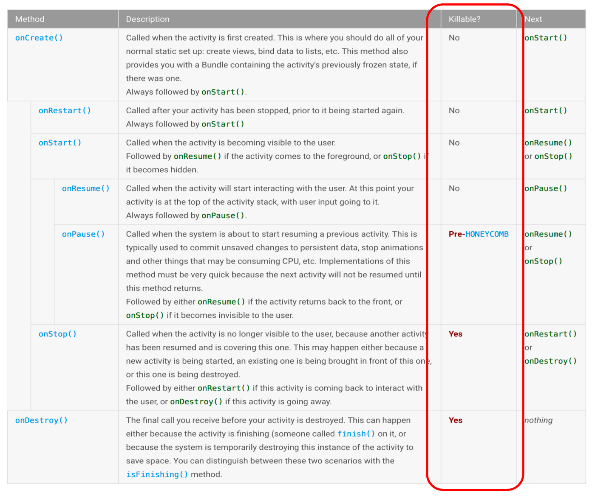
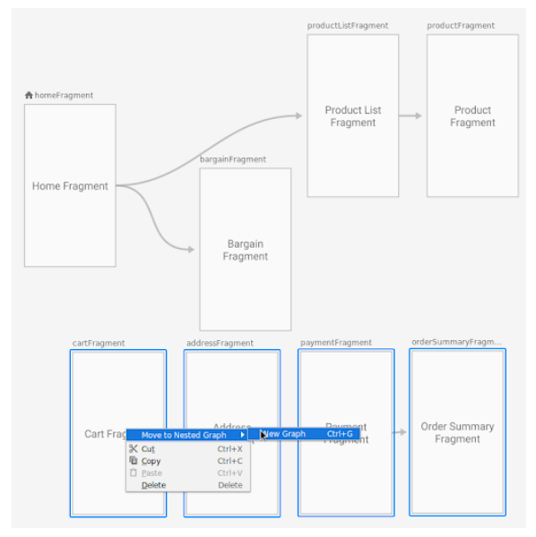

# Additional Information about ViewModel

## ViewModels: Persistence, onSaveInstanceState(), ~~Restoring UI State and Loaders~~

### Do ViewModels persist my data?

* ViewModels hold **transient data used in the UI** but they don’t persist data. Once the associated UI Controller (fragment/activity) is destroyed or the process is stopped, the ViewModel and all the contained data gets marked for garbage collection.


> Figure 6. Activity lifecycle documentation.

* As a reminder, when an app processes is stopped due to resource constraints, it’s stopped without ceremony and **no additional lifecycle callbacks are called**. This means that you can’t rely on `onDestroy` being called. You **do not** have a chance to persist data at the time of process shutdown. Therefore, if you want to be the most sure that you won’t lose data, persist it as soon as the user enters it.

### Are ViewModels a replacement for onSaveInstanceState?

* No, but they are related

* To understand the subtleties of this difference, it’s helpful to understand the difference between `onSaveInstanceState()` and `Fragment.setRetainInstance(true)`

* **onSaveInstanceState()**: This callback is meant to retain a **small** amount of UI related data in two situations:
    * The app’s process is stopped when it’s in the background due to memory constraints.
    * Configuration changes.

* `onSaveInstanceState()` is called in situations in which the activity is **stopped**, but not **finished**, by the system. It is **not** called when the user explicitly closes the activity or in other cases when `finish()` is called.

* Note that a lot of UI data is automatically saved and restored for you:
> “The default implementation of this method saves transient information about the state of the activity’s view hierarchy, such as the text in an EditText widget or the scroll position of a ListView widget.”

* `onSaveInstanceState()` **is not designed** to store large amounts of data, such as bitmaps.`onSaveInstanceState()` is designed to store data that is small, related to the UI and not complicated to serialize or deserialize. Serialization can consume lots of memory if the objects being serialized are complicated. Because this process happens on the main thread during a configuration change, it needs to be fast so that you don’t drop frames and cause visual stutter.

* **Fragment.setRetainInstance(true):** The _Handling Configuration Changes_ documentation describes a process for storing data during a configuration change using a retained fragment. This sounds less useful than `onSaveInstanceState()` which covers both configuration changes as well as process shutdown. The usefulness of creating a retained fragment is that it’s meant to retain large sets of data such as images or to retain complex objects like network connections.

* **ViewModels only survive configuration change-related destruction; they do not survive the process being stopped**. This makes ViewModels a replacement for using a fragment with `setRetainInstance(true)` (in fact ViewModels use a fragment with **setRetainInstance** set to true behind the scenes).

* Additional benefits of using ViewModel in addition to `onSaveInstanceState()`:
    * ViewModels encourage good architectural design. Your data is separated from your UI code.
    * A ViewModel can delegate the loading of complex data and also act as temporary storage once this data is loaded.

---

## ViewModels with ~~Saved State~~, Jetpack Navigation, Data Binding and Coroutines

### ViewModel and Jetpack Navigation : NavGraph with a ViewModel

* **Navigation 2.1.0** introduces ViewModels associated to a Navigation Graph. In practice, this means you can take a collection of associated destinations, such as an onboarding flow, a login flow, or a checkout flow; put them into a **nested navigation graph**; and enable shared data just between those screens.

* To create a nested navigation graph, you can select your screens, right click, and select **Move to Nested Graph → New Graph**:


> Figure 7. Screenshot showing how to “Move to Nested Graph”.

* In the XML view, note the **id** of the nested navigation graph, in this case `checkout_graph`:

```
<navigation app:startDestination="@id/homeFragment" ...>
<fragment android:id="@+id/homeFragment" .../>
<fragment android:id="@+id/productListFragment" .../>
<fragment android:id="@+id/productFragment" .../>
<fragment android:id="@+id/bargainFragment" .../>

    <navigation 
    	android:id="@+id/checkout_graph" 
    	app:startDestination="@id/cartFragment">

        <fragment android:id="@+id/orderSummaryFragment".../>
        <fragment android:id="@+id/addressFragment" .../>
        <fragment android:id="@+id/paymentFragment" .../>
        <fragment android:id="@+id/cartFragment" .../>

    </navigation>

</navigation>
```

* Once you’ve done this, you get the ViewModel using `by navGraphViewModels`:

```
val viewModel: CheckoutViewModel by navGraphViewModels(R.id.checkout_graph)
```

* Note that a nested graph is encapsulated from the rest of the navigation graph. You can navigate to a nested graph (you’ll go to the start destination of the nested graph), but you cannot navigate directly to a particular destination within the nested graph from outside of the graph. Thus they are meant for encapsulated collections of screens, like a checkout flow or a login flow.

### ViewModel and Data Binding : Use your ViewModel and LiveData in Data Binding

```
override fun onActivityCreated(savedInstanceState: Bundle?) {
    super.onActivityCreated(savedInstanceState)

    myViewModel.name.observe(this, { newName ->
        // Update the UI. In this case, a TextView.
        nameTextView.text = newName
    })

}
```

* The **Data Binding library** is all about observing your data and updating the UI. By using ViewModel, LiveData and Data Binding together, you can remove the previous LiveData observation code and reference your ViewModel and LiveData straight from the layout XML.

* Let’s say in your XML layout you want to reference your ViewModel:

```
<layout xmlns:android="http://schemas.android.com/apk/res/android">
    <data>
        <variable name="viewmodel" 
                  type="com.android.MyViewModel"/>
    </data>
    <... Rest of your layout ...>
</layout>

```

* To use LiveData with Data Binding, you just need to call `binding.setLifecycleOwner(this)` and then pass your ViewModel to your binding, like so:

```
class MainActivity : AppCompatActivity() {

    // This ktx requires at least androidx.activity:activity-ktx:1.0.0
    private val myViewModel: MyViewModel by viewModels()

    override fun onCreate(savedInstanceState: Bundle?) {
        super.onCreate(savedInstanceState)
      
         //Inflate view and create binding
        val binding: MainActivityBinding = 
            DataBindingUtil.setContentView(this, R.layout.main_activity)

        //Specify this activity as the lifecycleOwner for Data Binding
        binding.lifecycleOwner = this
        
        // Pass the ViewModel into the binding
        binding.viewmodel = myViewModel
    }

}
```

* Now in your layout, you can use your ViewModel. As seen below, I set the text to `viewmodel.name`:

```
<layout xmlns:android="http://schemas.android.com/apk/res/android">
    <data>
        <variable name="viewmodel" 
                  type="com.android.MyViewModel"/>
    </data>
    <TextView
            android:id="@+id/name"
            android:text="@{viewmodel.name}"
            android:layout_height="wrap_content"
            android:layout_width="wrap_content"/>
</layout>
```

* Note that `viewmodel.name` could be a String or a LiveData. If it’s a LiveData, the UI will update whenever the LiveData changes.

### ViewModel and Kotlin Coroutines: viewModelScope

* Often if your ViewModel is destroyed, there’s a bunch of “work” associated with the ViewModel that should be stopped as well.

* For example, let’s say you’re preparing a bitmap to show on-screen. That’s an example of work you should do without blocking the main thread and work that should be stopped if you permanently navigate away from or close the screen. For work like this, you should use **viewModelScope**.

* **viewModelScope** is a Kotlin extension property on the ViewModel class. It is a CoroutineScope that is cancelled once the ViewModel is destroyed (when `onCleared()` is called). Thus when you’re using a ViewModel, you can start all of your coroutines using this scope.

```
class MyViewModel() : ViewModel() {

    fun initialize() {
        viewModelScope.launch {
            processBitmap()
        }
    }
        
    suspend fun processBitmap() = withContext(Dispatchers.Default) {
        // Do your long running work here
    }

}
```

* The excellent blogpost [Easy Coroutines in Android: viewModelScope](https://medium.com/androiddevelopers/easy-coroutines-in-android-viewmodelscope-25bffb605471) goes into a bunch more detail if you’re using Kotlin Coroutines and ViewModels.
